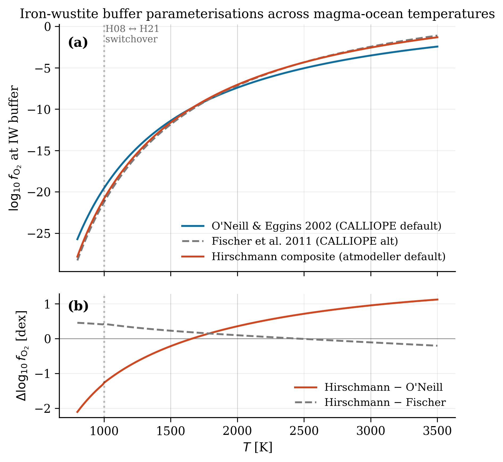
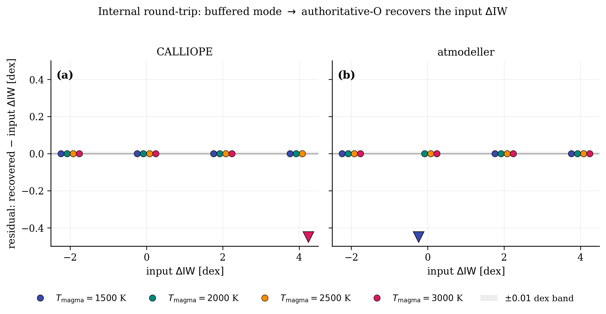
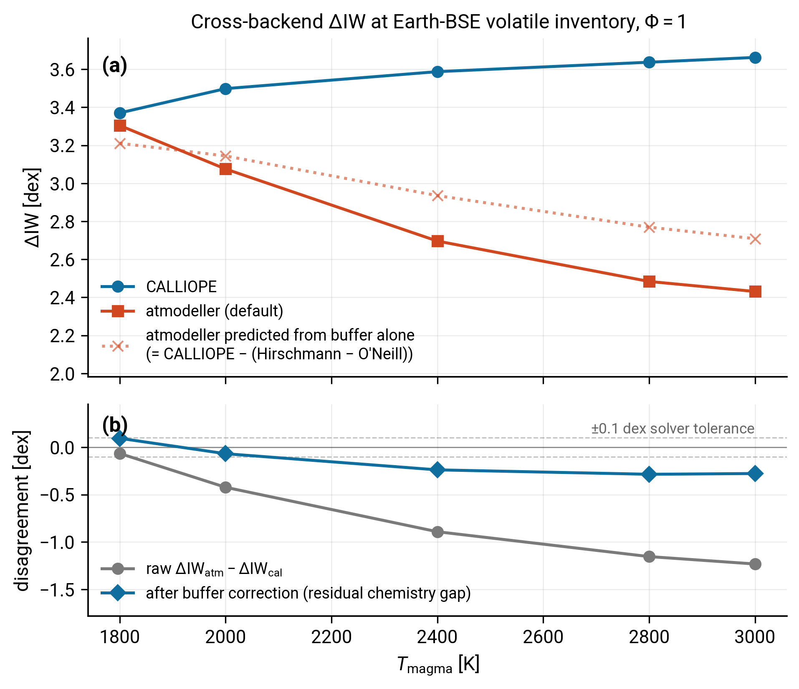
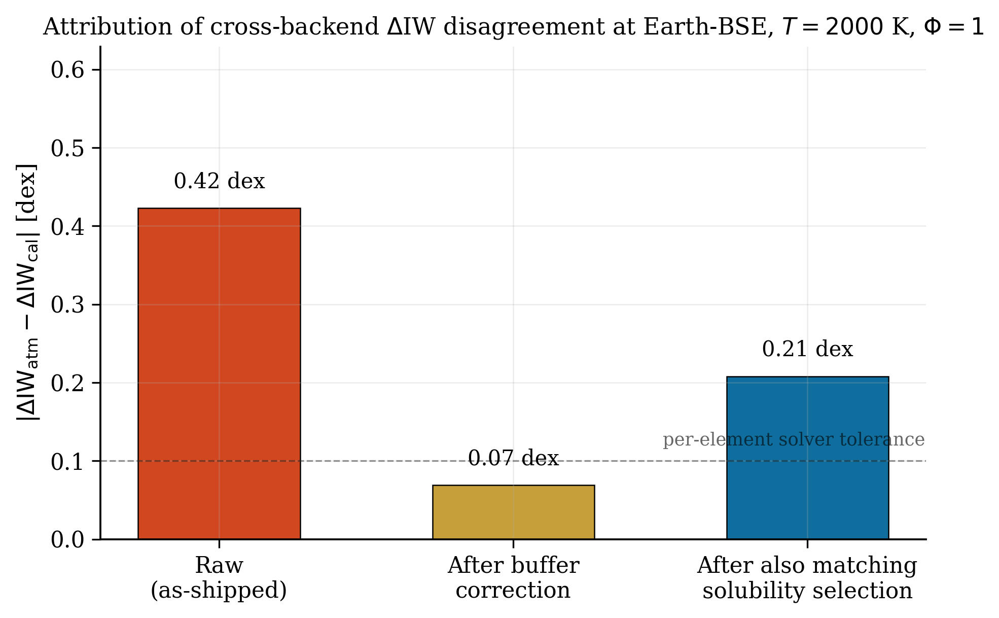
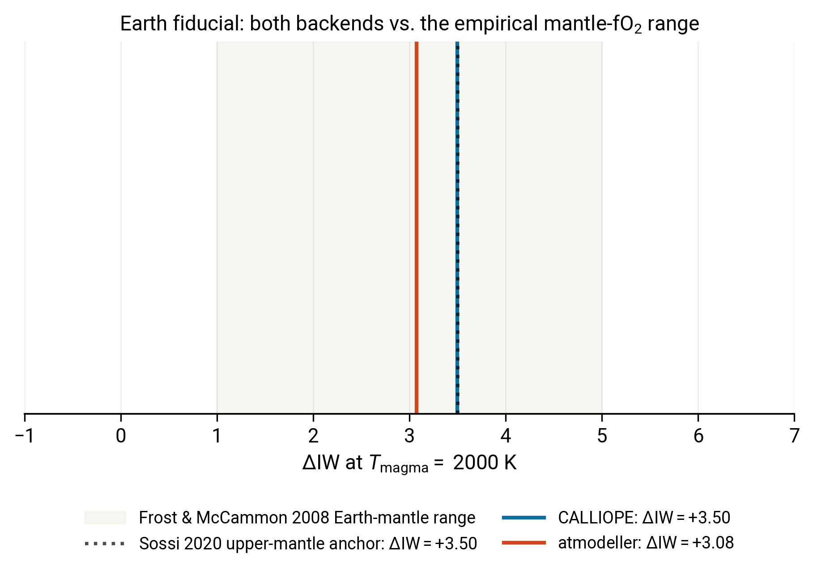

# Backend comparison

PROTEUS supports two outgassing backends with an authoritative-O entry point: CALLIOPE and [atmodeller](https://atmodeller.readthedocs.io/).
Both invert the same closure (the user-supplied O budget is the volatile O that participates in atmospheric and dissolved chemistry; the IW-buffer offset $\Delta\mathrm{IW}$ becomes the fifth unknown), but they implement it with different IW-buffer parameterisations, different solubility-law selections, different gas-phase equation-of-state choices, and different solver architectures.

This page quantifies where the two backends agree and where they disagree, so that a user picking a backend for a coupled run can reason about the systematic that choice implies.

The figures here are regenerated by the reusable scripts in `scripts/cross_backend/`; see [Reproducing this page](#reproducing-this-page) at the end.

## The Earth fiducial used throughout this page

A cross-backend comparison only carries meaning if both solvers are fed the same inputs.
Figures 3, 4, and 5 all run both backends at one shared Earth fiducial so that any disagreement they show is attributable to the backends' internal choices (buffer, solubility, EOS, equilibrium-constant fits) rather than to a difference in the inputs.
The fiducial is Earth bulk-silicate-Earth (BSE), $\Phi = 1$, with $T_\mathrm{magma}$ either fixed at 2000 K (Figures 4 and 5) or swept from 1800 K to 3000 K (Figure 3).
Earth is the natural anchor because the modern upper-mantle $\Delta\mathrm{IW}$ is empirically constrained (Sossi et al. 2020[^cite-sossi2020]; Frost & McCammon 2008[^cite-frostmccammon2008]), which lets us check in Figure 5 whether either backend's prediction lands inside the petrologically allowed range.

The H / C / N / S inputs come from the Krijt et al. 2023[^cite-krijt2023] Protostars and Planets VII Tables 1 and 2 BSE row, summed across mantle and atmospheric reservoirs:

| Element | Krijt+2023 BSE mass (kg) |
|---|---|
| H | $5.6 \times 10^{20}$ |
| C | $3.1 \times 10^{21}$ |
| N | $3.7 \times 10^{19}$ |
| S | $1.0 \times 10^{21}$ |

Oxygen is not taken from Krijt et al. 2023 directly.
Krijt's tabulated O is a redox-active inventory (the mass of O required to move BSE to the Fe(II)O reference state, dominated by the mantle FeO / Fe$_2$O$_3$ imbalance), whereas the authoritative-O entry point treats O as the volatile budget (atoms in atmospheric and dissolved H$_2$O / CO$_2$ / SO$_2$ / O$_2$ only).
The two definitions are not interconvertible without a chemistry calculation.
The volatile-O reference used on this page, $O = 1.26 \times 10^{22}$ kg, was derived by running CALLIOPE in buffered mode at the Krijt H/C/N/S budget above, $T_\mathrm{magma} = 2000$ K, and the Sossi 2020[^cite-sossi2020] $\Delta\mathrm{IW} = +3.5$ Earth-upper-mantle anchor with the current default Fischer 2011 buffer.
The provenance function `scripts/cross_backend/inventories.derive_earth_volatile_O()` re-derives this number from scratch on demand.

## Sources of disagreement

Four axes contribute to cross-backend $\Delta\mathrm{IW}$ disagreement. Two can be aligned at the wrapper level, two cannot.

| Axis | CALLIOPE | atmodeller | Aligned by default? |
|---|---|---|---|
| IW buffer | Fischer et al. 2011[^cite-fischer2011] (current default, see below); O'Neill & Eggins 2002[^cite-oneilleggins2002] available as legacy `'oneill'` | Hirschmann composite (Hirschmann et al. 2008[^cite-hirschmann2008] below 1000 K, Hirschmann 2021[^cite-hirschmann2021] above) | Close (Fischer is within ~0.2 dex of Hirschmann across the magma-ocean range) |
| H$_2$O solubility | Sossi et al. 2023[^cite-sossi2023] peridotite | `H2O_peridotite_sossi23` | Yes |
| CO$_2$ solubility | Dixon et al. 1995[^cite-dixon1995] basalt | `CO2_basalt_dixon95` | Yes |
| N$_2$ solubility | Dasgupta et al. 2022[^cite-dasgupta2022] | `N2_basalt_dasgupta22` | Yes |
| S$_2$ solubility | Gaillard et al. 2022[^cite-gaillard2022] sulfide-only | `S2_sulfide_basalt_boulliung23` (Boulliung & Wood 2023[^cite-boulliungwood2023], CoMP) | No |
| H$_2$, CO, CH$_4$ solubility | identically zero (Bower et al. 2022[^cite-bower2022] §2.2.3) | Hirschmann 2012, Yoshioka 2019, Ardia 2013 | Optionally (set keys to `none`) |
| Gas-phase EOS | ideal | ideal by default; real-gas selectable | Yes (with EOS off) |
| Equilibrium constants | JANAF + Schaefer-Fegley fits | atmodeller thermodata | No |
| Solver | scipy `fsolve` + `trust-constr` with Monte-Carlo restart | JAX gradient-based with multistart | Different by construction; affects convergence behaviour, not converged answer |

## Buffer convention as a cross-backend systematic

CALLIOPE's default IW buffer is Fischer et al. 2011[^cite-fischer2011], with O'Neill & Eggins 2002[^cite-oneilleggins2002] available as `OxygenFugacity('oneill')` for backwards compatibility. atmodeller uses the Hirschmann composite (Hirschmann 2008 below 1000 K, Hirschmann 2021 above). Across magma-ocean temperatures O'Neill and Hirschmann differ by up to $\sim 1$ dex; Fischer and Hirschmann agree to within $\sim 0.2$ dex over the same range, so the cross-backend buffer offset under the current default is much smaller than under the legacy choice.



*Figure 1. (a) IW-buffer parameterisations across magma-ocean temperatures. The Hirschmann composite switches from Hirschmann 2008 to Hirschmann 2021 at 1000 K, which produces a kink that the monolithic parameterisations do not have. (b) Difference between Hirschmann composite and the two CALLIOPE options, in dex. At $T = 3000$ K the Hirschmann buffer is $0.95$ dex more oxidising than O'Neill but only $0.11$ dex below Fischer, an order of magnitude smaller. Fischer 2011 hugs Hirschmann everywhere above $\sim 1700$ K.*

The buffer choice therefore moves the default residual from $\sim 1$ dex (with the legacy O'Neill setting) down to $\lesssim 0.2$ dex (with the Fischer default). The remaining cross-backend disagreement is genuinely chemistry-level (solubility laws, equilibrium-constant fits) rather than buffer-level.

## Each backend is internally self-consistent

Before comparing backends to each other, each must round-trip self-consistently: start from a buffered-mode call at a known $\Delta\mathrm{IW}$, take the resulting O budget, feed it back into the authoritative-O entry point, and recover the input $\Delta\mathrm{IW}$. We sweep $T_\mathrm{magma}$ because the chemistry itself is temperature-dependent: the equilibrium constants are evaluated at $T$, the Dasgupta nitrogen solubility carries explicit $T$ and $f_{\mathrm{O}_2}$ terms, and the Gaillard sulfur solubility carries an explicit $f_{\mathrm{O}_2}$ term. A round-trip that only worked at one $T$ would not be evidence of internal consistency; the test must cover the full range where the calibrated chemistry is meant to apply.



*Figure 2. Round-trip residuals $\Delta\mathrm{IW}_\mathrm{recovered} - \Delta\mathrm{IW}_\mathrm{input}$ for each backend at $T_\mathrm{magma} \in \{1500, 2000, 2500, 3000\}\,\mathrm{K}$ and input $\Delta\mathrm{IW} \in \{-2, 0, +2, +4\}$. Coloured circles map to the four temperatures (cool to warm); horizontal jitter is added so the four temperature markers fan out at each input $\Delta\mathrm{IW}$ rather than stacking. The grey band marks the $\pm 0.01$ dex solver tolerance. (a) CALLIOPE: all but one grid point sit well inside the tolerance band; the magenta triangle at the bottom right marks the one edge case where the authoritative-O solver landed in a secondary basin and returned $\Delta\mathrm{IW}_\mathrm{recovered} = -5.84$ from an input of $+4$ at $T = 3000$ K. (b) atmodeller: all converged grid points are inside the tolerance band; the indigo triangle at the bottom of panel (b) marks the one grid point where the solver failed to converge ($T = 1500$ K, input $\Delta\mathrm{IW} = 0$).*

Internal consistency holds across the bulk of the $(T, \Delta\mathrm{IW})$ grid relevant to terrestrial magma oceans. The two off-scale points are solver-edge cases at the corners of the swept range and are flagged honestly rather than masked. They do not affect the cross-backend comparison in Figure 3, which is run at one Earth-volatile-rich fiducial well inside the well-behaved region of each solver.

## Cross-backend agreement on the chemistry

With internal consistency confirmed, the cross-backend $\Delta\mathrm{IW}$ disagreement at matched inputs is the interesting quantity. Both backends are run at the Krijt et al. 2023[^cite-krijt2023] BSE H/C/N/S inventory with the volatile O reference set by a CALLIOPE buffered-mode call at $\Delta\mathrm{IW} = +3.5$ (the Sossi 2020[^cite-sossi2020] Earth upper-mantle anchor). Sweeping $T_\mathrm{magma}$ from 1800 K to 3000 K, with $\Phi = 1$ throughout, gives:



*Figure 3. (a) Converged $\Delta\mathrm{IW}$ from each backend across $T_\mathrm{magma}$ at fixed Earth-BSE Krijt+2023 volatile inventory and $\Phi = 1$. Solid blue circles: CALLIOPE with the current default Fischer 2011 buffer. Dashed grey: CALLIOPE with the legacy O'Neill 2002 buffer. Solid red squares: atmodeller (Hirschmann composite). The dotted red curve is CALLIOPE-F's $\Delta\mathrm{IW}$ minus the analytical Hirschmann-minus-Fischer offset at the same $T$: it is where atmodeller would land if the two backends used identical chemistry and the buffer was the only difference. (b) Two raw cross-backend gaps and the buffer-corrected residual. Solid grey: raw $\Delta\mathrm{IW}_\mathrm{atm} - \Delta\mathrm{IW}_\mathrm{CALLIOPE,F}$. Dashed grey: raw gap against the legacy O'Neill buffer. Solid blue diamonds: residual after the analytical buffer correction (numerically the same for either buffer, by construction). Dashed lines bracket the $\pm 0.1$ dex solver tolerance.*

Panel (a) shows the dashed legacy curve (O'Neill) drifting away from atmodeller as $T$ rises, while the solid default curve (Fischer) hugs atmodeller within a few tenths of a dex everywhere on the sweep. Panel (b) makes this precise: the raw $\Delta\mathrm{IW}$ gap with the legacy buffer grows from $-0.07$ dex at $T = 1800$ K to $-1.23$ dex at $T = 3000$ K, while the same gap with the Fischer default never exceeds $-0.25$ dex in magnitude across the same range. The buffer-corrected residual (which subtracts the analytical Hirschmann-minus-buffer offset and is therefore independent of which buffer CALLIOPE used) stays within $\pm 0.1$ dex at $T \le 2000$ K and reaches about $-0.28$ dex at the hottest end. At the cold end of the sweep ($T \le 2000$ K) the Fischer raw gap is comparable to or smaller than the residual chemistry gap; above $\sim 2000$ K the residual chemistry gap dominates, consistent with the S$_2$ sulfate-regime divergence between Gaillard 2022 and Boulliung & Wood 2023 becoming larger at hotter, more oxidising conditions. Either way the cross-backend disagreement has dropped from "buffer-dominated, up to 1 dex" with the legacy default to "chemistry-dominated, a few tenths of a dex" with the new default.

A wider 2D sweep over O budget was attempted first and abandoned: the authoritative-O entry point has a documented non-monotonic regime at sub-trace O budgets where the residual surface develops a second root and a basin-selection sensitivity dominates over the cross-backend physics signal. Inside the regime where both backends consistently land in the oxidising basin (the physically expected regime for terrestrial inventories), the comparison is the one shown above.

## Attribution of residual disagreement

A bar-chart breakdown of the cross-backend gap at the canonical Earth fiducial isolates which alignment moves dominate.



*Figure 4. $|\Delta\mathrm{IW}_\mathrm{atmodeller} - \Delta\mathrm{IW}_\mathrm{CALLIOPE}|$ at the canonical Earth fiducial, in four configurations of increasing alignment. Bar 1 is the raw disagreement under the legacy O'Neill 2002 buffer. Bar 2 is the raw disagreement under the current Fischer 2011 default; the drop from bar 1 to bar 2 is what the buffer-default change buys for free. Bar 3 removes the residual buffer contribution by subtracting the analytical Hirschmann-minus-Fischer offset. Bar 4 additionally forces atmodeller to disable H$_2$ / CO / CH$_4$ solubility, matching CALLIOPE's Bower 2022 §2.2.3 convention. The dashed line marks the per-element solver tolerance.*

The raw disagreement of $0.42$ dex at this fiducial under the legacy buffer falls to $0.16$ dex with the Fischer default, just above the per-element solver tolerance. The analytical buffer correction takes it the rest of the way: $0.07$ dex, below tolerance. Forcing the H$_2$ / CO / CH$_4$ solubility alignment moves atmodeller's converged $\Delta\mathrm{IW}$ enough to grow the disagreement back to $0.21$ dex; that move shows that atmodeller's H$_2$ / CO / CH$_4$ solubility defaults were partially compensating for the buffer-convention difference, and removing them surfaces a small chemistry-level mismatch that is otherwise hidden. The takeaway after the buffer-default change is that the as-shipped disagreement is now at the few-tenths-of-a-dex level, dominated by the remaining solubility-law differences (S$_2$ above all) rather than by the IW-buffer choice.

## Comparison against the Earth anchor

Both backends produce a $\Delta\mathrm{IW}$ from the Krijt+2023[^cite-krijt2023] BSE H/C/N/S inventory (with volatile O derived self-consistently at the Sossi 2020 $\Delta\mathrm{IW} = +3.5$ baseline). The empirical anchor for Earth's modern upper mantle is the Frost & McCammon (2008)[^cite-frostmccammon2008] range $\Delta\mathrm{IW} \in [+1, +5]$ (FMQ-3 to FMQ+1), with the Sossi et al. 2020[^cite-sossi2020] best estimate at $+3.5$.



*Figure 5. Each backend's converged $\Delta\mathrm{IW}$ at the Earth fiducial, overlaid on the Frost & McCammon 2008 empirical range and the Sossi 2020 best estimate. Solid blue: CALLIOPE with the Fischer 2011 default. Dashed grey: CALLIOPE with the legacy O'Neill 2002 buffer (recovers $+3.50$ by construction because the volatile-O reference was derived from a CALLIOPE-O'Neill buffered call at this state). Solid red: atmodeller. With the Fischer default CALLIOPE lands at $\Delta\mathrm{IW} \approx +3.24$, between atmodeller and Sossi 2020; the CALLIOPE-vs-atmodeller gap is now $0.16$ dex rather than the legacy $0.42$ dex.*

All three backend points fall inside the empirical Frost & McCammon range. Neither parameterisation is in tension with petrology at this single fiducial; the cross-backend gap, even before the analytical buffer correction, is now well inside the petrological uncertainty on Earth's mantle $\Delta\mathrm{IW}$.

## Choosing a backend for your study

With the Fischer 2011 default in place, the as-shipped CALLIOPE and atmodeller backends agree to a few tenths of a dex in $\Delta\mathrm{IW}$ across the magma-ocean range. The dominant residual is now the chemistry-level disagreement (S$_2$ solubility law above all), not the IW-buffer choice. The practical implications are:

- **Either default backend is defensible.** With Fischer 2011 in CALLIOPE and Hirschmann in atmodeller, the cross-backend $\Delta\mathrm{IW}$ gap at Earth-like inputs is $\sim 0.16$ dex at $T = 2000$ K and stays below $\sim 0.3$ dex up to $T = 3000$ K. Either reading is well inside the petrological uncertainty on Earth's mantle.
- **Still pick one backend per coupled study.** Cross-backend $\Delta\mathrm{IW}$ values from the two solvers are not bit-identical, and mixing them inside one coupled run will introduce a few-tenths-of-a-dex drift. PROTEUS' helpfile records `fO2_shift_IW_derived` from the active backend; treat that column as backend-faithful, not cross-backend comparable.
- **If you need to reproduce legacy results**, set CALLIOPE to the O'Neill buffer (`OxygenFugacity('oneill')`). The legacy choice reproduces the older numbers verbatim; expect a $\sim 0.2$ to $\sim 1.0$ dex offset against atmodeller depending on $T$.
- **For oxidising-mantle work** above FMQ ($\Delta\mathrm{IW} \gtrsim +3$), the dominant sub-buffer disagreement is the S$_2$ channel. atmodeller's Boulliung & Wood 2023 law captures sulfate dissolution that Gaillard 2022 cannot; if your study turns on sulfur partitioning at oxidising conditions, prefer atmodeller.
- **When running in authoritative-O mode** (`planet.fO2_source = "from_O_budget"`), confirm that the backend you pick has consistent O accounting end-to-end: the derived $\Delta\mathrm{IW}$, the partial pressures, and the dissolved masses should all close back to the user O budget within solver tolerance. The [authoritative-oxygen page](authoritative_oxygen.md) describes the inputs and outputs.

## Reproducing this page

Every figure on this page is regenerated by the scripts in [`scripts/cross_backend/`](https://github.com/FormingWorlds/CALLIOPE/tree/main/scripts/cross_backend). To re-run:

```bash
# From the CALLIOPE repository root, with calliope and atmodeller installed
bash scripts/cross_backend/run_all.sh
```

Per-figure regeneration: `python3 -m scripts.cross_backend.fig3_grid` and similarly for the other figures.

The scripts write PDF and PNG outputs to `docs/assets/figures/cross_backend/` and raw CSV data to `scripts/cross_backend/data/`. Approximate total wall time on a modern Mac is twenty minutes, dominated by the atmodeller authoritative-O solver calls (~15 s warm, ~60 s cold first JAX compile per process).

The scripts are reusable for different fiducials, different inventories, or different alignment configurations; see [`scripts/cross_backend/README.md`](https://github.com/FormingWorlds/CALLIOPE/blob/main/scripts/cross_backend/README.md) for the extension pattern.

## See also

- [Authoritative-oxygen mode](authoritative_oxygen.md): the entry-point shared by both backends.
- [Oxygen fugacity](oxygen_fugacity.md): the four channels through which $\Delta\mathrm{IW}$ enters the chemistry.
- [Solubility laws](solubility.md): per-species validity envelopes for CALLIOPE's solubility selection.
- [Coupling to PROTEUS](proteus_coupling.md): how the PROTEUS wrapper selects between backends at runtime.
- [atmodeller documentation](https://atmodeller.readthedocs.io/): the canonical upstream reference for the second backend.

[^cite-boulliungwood2023]: J. Boulliung, B. J. Wood, *[Sulfur oxidation state and solubility in silicate melts](https://doi.org/10.1007/s00410-023-02033-9)*, Contributions to Mineralogy and Petrology, 178(8), 56, 2023. [SciX](https://scixplorer.org/abs/2023CoMP..178...56B/abstract).
[^cite-bower2022]: D. J. Bower, K. Hakim, P. A. Sossi, P. Sanan, *[Retention of water in terrestrial magma oceans and carbon-rich early atmospheres](https://doi.org/10.3847/PSJ/ac5fb1)*, The Planetary Science Journal, 3(4), 93, 2022. [SciX](https://scixplorer.org/abs/2022PSJ.....3...93B/abstract).
[^cite-dasgupta2022]: R. Dasgupta, E. Falksen, A. Pal, C. Sun, *[The fate of nitrogen during parent body partial melting and accretion of the inner Solar System bodies at reducing conditions](https://doi.org/10.1016/j.gca.2022.09.012)*, Geochimica et Cosmochimica Acta, 336, 291–307, 2022. [SciX](https://scixplorer.org/abs/2022GeCoA.336..291D/abstract).
[^cite-dixon1995]: J. E. Dixon, E. M. Stolper, J. R. Holloway, *[An experimental study of water and carbon dioxide solubilities in mid-ocean ridge basaltic liquids. Part I: Calibration and solubility models](https://doi.org/10.1093/oxfordjournals.petrology.a037267)*, Journal of Petrology, 36(6), 1607–1631, 1995. [SciX](https://scixplorer.org/abs/1995JPet...36.1607D/abstract).
[^cite-frostmccammon2008]: D. J. Frost, C. A. McCammon, *[The redox state of Earth's mantle](https://doi.org/10.1146/annurev.earth.36.031207.124322)*, Annual Review of Earth and Planetary Sciences, 36, 389–420, 2008. [SciX](https://scixplorer.org/abs/2008AREPS..36..389F/abstract).
[^cite-fischer2011]: R. A. Fischer, A. J. Campbell, G. A. Shofner, O. T. Lord, P. Dera, V. B. Prakapenka, *[Equation of state and phase diagram of FeO](https://doi.org/10.1016/j.epsl.2011.02.025)*, Earth and Planetary Science Letters, 304(3), 496–502, 2011.
[^cite-gaillard2022]: F. Gaillard, F. Bernadou, M. Roskosz, M. A. Bouhifd, Y. Marrocchi, G. Iacono-Marziano, M. Moreira, B. Scaillet, G. Rogerie, *[Redox controls during magma ocean degassing](https://doi.org/10.1016/j.epsl.2021.117255)*, Earth and Planetary Science Letters, 577, 117255, 2022. [SciX](https://scixplorer.org/abs/2022E%26PSL.57717255G/abstract).
[^cite-hirschmann2008]: M. M. Hirschmann, M. S. Ghiorso, F. A. Davis, S. M. Gordon, S. Mukherjee, T. L. Grove, M. Krawczynski, E. Médard, C. B. Till, *[Library of Experimental Phase Relations (LEPR): a database and Web portal for experimental magmatic phase equilibria data](https://doi.org/10.1029/2007GC001894)*, Geochemistry, Geophysics, Geosystems, 9(3), Q03011, 2008. [SciX](https://scixplorer.org/abs/2008GGG.....9.3011H/abstract).
[^cite-hirschmann2021]: M. M. Hirschmann, *[Iron-wüstite revisited: a revised calibration accounting for variable stoichiometry and the effects of pressure](https://doi.org/10.1016/j.gca.2021.08.039)*, Geochimica et Cosmochimica Acta, 313, 74–84, 2021. [SciX](https://scixplorer.org/abs/2021GeCoA.313...74H/abstract).
[^cite-krijt2023]: S. Krijt, M. Kama, M. McClure, J. Teske, E. A. Bergin, O. Shorttle, K. J. Walsh, S. N. Raymond, *Chemical habitability: supply and retention of life's essential elements during planet formation*, in Protostars and Planets VII, S. Inutsuka, Y. Aikawa, T. Muto, K. Tomida, M. Tamura, eds., Astronomical Society of the Pacific Conference Series, 534, 1031, 2023. [SciX](https://scixplorer.org/abs/2023ASPC..534.1031K/abstract).
[^cite-oneilleggins2002]: H. St. C. O'Neill, S. M. Eggins, *[The effect of melt composition on trace element partitioning: an experimental investigation of the activity coefficients of FeO, NiO, CoO, MoO$_2$ and MoO$_3$ in silicate melts](https://doi.org/10.1016/S0009-2541(01)00414-4)*, Chemical Geology, 186, 151–181, 2002. [SciX](https://scixplorer.org/abs/2002ChGeo.186..151O/abstract).
[^cite-sossi2020]: P. A. Sossi, A. D. Burnham, J. Badro, A. Lanzirotti, M. Newville, H. St. C. O'Neill, *[Redox state of Earth's magma ocean and its Venus-like early atmosphere](https://doi.org/10.1126/sciadv.abd1387)*, Science Advances, 6, eabd1387, 2020. [SciX](https://scixplorer.org/abs/2020SciA....6.1387S/abstract).
[^cite-sossi2023]: P. A. Sossi, P. M. E. Tollan, J. Badro, D. J. Bower, *[Solubility of water in peridotite liquids and the prevalence of steam atmospheres on rocky planets](https://doi.org/10.1016/j.epsl.2022.117894)*, Earth and Planetary Science Letters, 601, 117894, 2023. [SciX](https://scixplorer.org/abs/2023E%26PSL.60117894S/abstract).
