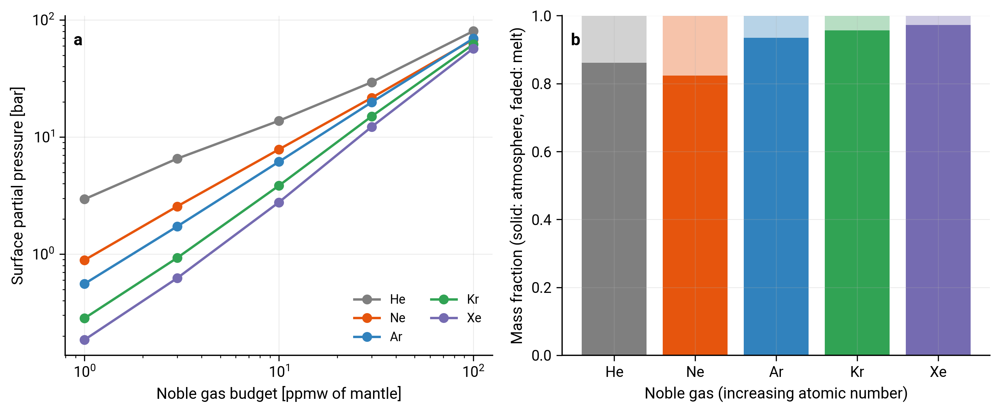

# Noble gases

CALLIOPE partitions the noble gases helium, neon, argon, krypton, and xenon between the magma ocean and the atmosphere alongside the reactive C-H-O-N-S volatiles. A noble gas is monatomic and chemically inert, which makes its treatment both simpler and structurally different from the reacting species.

## What makes a noble gas different

Each noble gas is at once an element and its only gas species: there is no molecule to form and no reaction to balance. It takes no part in the equilibrium-chemistry network, it carries no oxygen, and its abundance is unaffected by the oxygen fugacity of the mantle. Its entire melt-atmosphere behaviour is one linear Henry's law,

$$
X_i^\mathrm{melt} = \alpha_i\, p_i,
$$

with the dissolved concentration $X_i^\mathrm{melt}$ in ppmw, the surface partial pressure $p_i$ in bar, and a single solubility constant $\alpha_i$. What sets a noble gas apart from the reactive volatiles is not the linear form itself (some C-H-O-N-S laws are also linear in their own partial pressure while others are square-root, exponential, or a mixture) but the absence of any chemistry: the solubility carries no dependence on composition, temperature, or oxygen fugacity, and the gas is coupled to no other species through a reaction.

## Solubility constants

The constants come from Jambon, Weill & Braun (1986) [^cite-jambon1986], who measured noble gas solubilities in tholeiitic basalt melt at 1 bar and 1250-1600 C. The tabulated values are Henry constants $k$ in cm$^3$ STP per gram of melt per bar. CALLIOPE converts each to ppmw per bar through

$$
\alpha_i = \frac{k_i}{V_\mathrm{STP}}\, M_i \times 10^{6},
$$

where $V_\mathrm{STP} = 2.24\times10^{4}$ cm$^3$ mol$^{-1}$ is the molar volume of an ideal gas at standard temperature and pressure and $M_i$ is the molar mass in g mol$^{-1}$.

| Gas | $k$ [cm$^3$ STP g$^{-1}$ bar$^{-1}$] | $\alpha$ [ppmw bar$^{-1}$] |
|---|---:|---:|
| He | $56\times10^{-5}$ | 0.1001 |
| Ne | $25\times10^{-5}$ | 0.2252 |
| Ar | $5.9\times10^{-5}$ | 0.1052 |
| Kr | $3.0\times10^{-5}$ | 0.1122 |
| Xe | $1.7\times10^{-5}$ | 0.0996 |

The atmodeller outgassing backend uses the identical Jambon et al. (1986) constants and the same conversion, so the two backends produce the same solubility to floating-point precision and agree on the equilibrium noble gas pressure of a matched system to within the small differences in their C-H-O-N-S chemistry.

## Why they are solved jointly, not afterwards

Although a noble gas has no chemistry, it is not independent of the rest of the solve. Its partial pressure contributes to the total surface pressure and to the mean molar mass of the atmosphere. The mapping from a surface partial pressure to a column mass,

$$
m_i = p_i\,\frac{10^{5}}{g}\,4\pi R^{2}\,\frac{M_i}{\bar\mu},
$$

carries the mean molar mass $\bar\mu$ in its denominator, so a change in $\bar\mu$ changes the column mass of every species. A noble gas raises $\bar\mu$ where it is heavier than the background mean and lowers it where it is lighter, so the sign depends on the atmospheric composition: helium raises $\bar\mu$ in an H$_2$-dominated atmosphere but lowers it in a CO$_2$ or N$_2$ one, while xenon raises it in almost any composition. Each included noble gas is therefore carried as an additional unknown in the same mass-balance solve, with its own residual, rather than solved separately at fixed background.

## Specifying a noble gas budget

Noble gases are opt-in for each gas. A run with no noble gas budget is unchanged. When a noble gas is included, its inventory is supplied in ppmw relative to the mantle mass, the same convention CALLIOPE uses for nitrogen and sulfur. Both the fixed-oxygen-fugacity solver and the authoritative-oxygen solver carry the noble gases.

## How the five gases behave

Each of the five noble gases is run through `equilibrium_atmosphere` against a fixed Earth-like C-H-O-N-S background. Panel (a) sweeps the supplied budget and shows the surface partial pressure rising with it, close to linear where the noble gas is a trace component and bending as the gas comes to dominate the atmosphere and shift its mean molar mass. Panel (b) shows the split between atmosphere and melt at a representative budget. The dissolved-to-atmospheric ratio is set by the volume-based Jambon constant (cm$^3$ STP per gram of melt per bar) and the atmosphere's mean molar mass; the molar-mass factor cancels out of the mass-based ppmw-per-bar constant, so retention does not simply track that constant. In this Earth-like background neon is the most retained in the melt and xenon the least, so xenon sits almost entirely in the atmosphere. The figure is produced by [`scripts/tutorials/fig_noble_gases.py`](https://github.com/FormingWorlds/CALLIOPE/blob/main/scripts/tutorials/fig_noble_gases.py) and can be re-run with `python -m scripts.tutorials.fig_noble_gases` from the repository root.

## Validity envelope

The Jambon et al. (1986) constants are a 1 bar, tholeiitic-basalt calibration measured between 1250 and 1600 C, applied as a strictly linear Henry's law with no saturation term. At the high surface pressures of a genuinely noble-gas-rich atmosphere this is an extrapolation on two counts: the pressure lies far above the 1 bar calibration, and the linear form assumes the melt never approaches saturation. The parameterization carries no temperature dependence, so applying it at magma-ocean surface temperatures above the 1600 C calibration ceiling is a further extrapolation. CALLIOPE also applies the single tholeiite calibration to all melt compositions. Results in the high-pressure, high-temperature, noble-gas-dominated regime should be read with these limitations in mind.

## Where the code lives

- `src/calliope/constants.py`: the `noble_gases` list, molar masses, and colours.
- `src/calliope/solubility.py`: `SolubilityNobleGas` and the `jambon86_ppmw_per_bar` conversion.
- `src/calliope/solve.py`: the noble gas unknowns, residuals, and the two-stage warm start in `equilibrium_atmosphere` and `equilibrium_atmosphere_authoritative_O`.

## References

 [^cite-jambon1986]: A. Jambon, H. Weill, J. Braun, *[Solubility of He, Ne, Ar, Kr and Xe in a basalt melt in the range 1250-1600 C. Geochemical implications](https://doi.org/10.1016/0016-7037(86)90193-6)*, Geochimica et Cosmochimica Acta, 50(3), 401-408, 1986. [SciX](https://scixplorer.org/abs/1986GeCoA..50..401J/abstract).
