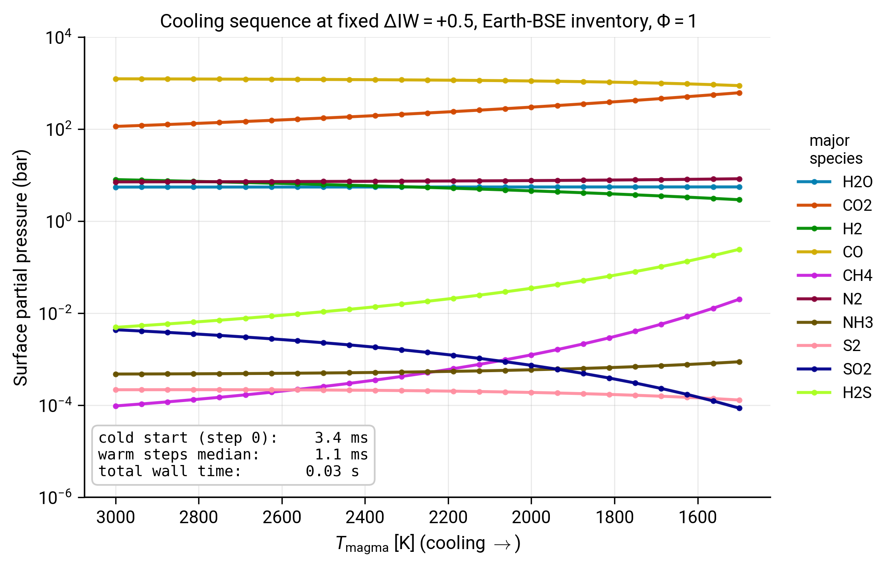

# Coupled-loop driver

The most common real-world use of CALLIOPE is inside a time-stepping outer loop that advances a magma ocean through cooling, escape, or any other process that re-equilibrates the atmosphere at each step. This tutorial shows the warm-start pattern that makes such loops efficient.

By the end of it you will:

- have written a minimal cooling-sequence driver that calls CALLIOPE at each time step;
- know which fields to thread between iterations as `p_guess`;
- have measured the warm-start speed-up directly: cold-start solve vs warm-start solve;
- have produced the time-series partial-pressure plot on the front of this page.

You should already have completed the [First run](firstrun.md) tutorial. Familiarity with [Two-mode round-trip](two_modes.md) is helpful but not required.

## What "warm start" means in CALLIOPE

CALLIOPE's `equilibrium_atmosphere` solves a 4-by-4 nonlinear mass-balance system in the partial pressures $(p_\mathrm{H_2O}, p_\mathrm{CO_2}, p_\mathrm{N_2}, p_\mathrm{S_2})$. Without an initial guess, it draws Monte-Carlo log-uniform restarts (up to `nguess`, default 7500) until fsolve converges to a basin that satisfies mass balance. With a `p_guess` dictionary close to the solution, fsolve typically converges on the first attempt and the call completes in a few milliseconds rather than tens to hundreds.

In a time-stepping loop where the chemistry changes slowly (i.e. each step is a small perturbation of the previous), the previous step's converged partial pressures are an excellent guess for the next. This is the warm-start pattern.

## Step 1: write a cooling-sequence driver

```python
import time
import warnings

import numpy as np

from calliope.constants import volatile_species
from calliope.solve import equilibrium_atmosphere

planet = {'M_mantle': 4.03e24, 'gravity': 9.81, 'radius': 6.371e6}
earth_hcns = {'H': 5.6e20, 'C': 3.1e21, 'N': 3.7e19, 'S': 1.0e21}

T_sequence = np.linspace(3000.0, 1500.0, 25)
diw_fixed  = 0.5            # hold redox fixed: the focus is cooling

species_to_track = ['H2O', 'CO2', 'H2', 'CO', 'CH4',
                    'N2', 'NH3', 'S2', 'SO2', 'H2S']
history = {sp: np.full(T_sequence.size, np.nan) for sp in species_to_track}
wall    = np.zeros(T_sequence.size)

p_guess = None             # cold-start the first call
```

## Step 2: the loop, with warm-start threading

```python
for i, T in enumerate(T_sequence):
    ddict = {**planet, 'T_magma': float(T), 'Phi_global': 1.0,
             'fO2_shift_IW': diw_fixed}
    for sp in volatile_species:
        ddict[f'{sp}_included']    = 1
        ddict[f'{sp}_initial_bar'] = 0.0

    t0 = time.time()
    with warnings.catch_warnings():
        warnings.simplefilter('ignore')
        res = equilibrium_atmosphere(
            earth_hcns, ddict, p_guess=p_guess, print_result=False,
        )
    wall[i] = time.time() - t0

    for sp in species_to_track:
        history[sp][i] = float(res[f'{sp}_bar'])

    # Thread the four primary partial pressures forward as the next
    # iteration's guess. Other species are derived from these four via
    # the equilibrium reactions, so re-seeding them is not necessary.
    p_guess = {s: float(res[f'{s}_bar']) for s in ('H2O', 'CO2', 'N2', 'S2')}

print(f'cold-start step: {wall[0]*1e3:6.1f} ms')
print(f'warm-step median: {np.median(wall[1:])*1e3:6.1f} ms')
```

You should see the warm steps run roughly 3-10x faster than the cold start (the exact ratio depends on how lucky the cold-start Monte-Carlo draw is on the first call).

!!! note "Which keys to thread forward"
    The four primary partial pressures are `H2O`, `CO2`, `N2`, `S2`. CALLIOPE's solver uses these four as its unknowns; the other six species (`H2`, `CO`, `CH4`, `NH3`, `SO2`, `H2S`) are derived from the primaries via the equilibrium reactions, so they should *not* appear in `p_guess`. Passing them anyway is harmless (they will be ignored), but missing one of the four primaries raises `ValueError`.

!!! warning "When to invalidate the warm start"
    If a step changes the chemistry by a large factor (e.g. an instantaneous escape event that removes 90% of the H budget), the previous-step guess is no longer close to the new basin. In that case the warm start can actually hurt: fsolve dives into a poor local minimum instead of restarting cleanly. Set `p_guess = None` whenever the inventory or boundary conditions change discontinuously, then let the next call cold-start.

## Step 3: plot the cooling-sequence history

```python
import matplotlib.pyplot as plt

from calliope.constants import dict_colors

fig, ax = plt.subplots(figsize=(7.4, 5.0))
for sp in species_to_track:
    ax.plot(T_sequence, history[sp],
            color=dict_colors[sp], marker='o', markersize=3.5,
            linewidth=1.8, label=sp)
ax.set_yscale('log')
ax.set_xlabel(r'$T_\mathrm{magma}$ [K] (cooling reads left-to-right)')
ax.set_ylabel('Surface partial pressure (bar)')
ax.set_ylim(1e-6, 1e4)
ax.invert_xaxis()
ax.grid(which='both', alpha=0.3)
ax.legend(loc='center left', bbox_to_anchor=(1.02, 0.5), frameon=False)
fig.tight_layout()
fig.savefig('cooling_sequence.pdf')
```

## The goal of this tutorial



*Surface partial pressures across a 25-step cooling sequence from 3000 K down to 1500 K at fixed $\Delta\mathrm{IW} = +0.5$ and Earth-BSE inventory. The legend lists the ten tracked species in their PROTEUS-standard colours. The annotation bottom-left shows the cold-start time (first call), the warm-step median (every subsequent call), and the total wall time for the 25-step loop.*

The atmosphere stays carbon-dominated across the whole cooling range; CO is the dominant species throughout (CO/CO$_2$ ratio falls modestly as $T$ drops). The fastest-moving species are H$_2$S (rises) and S$_2$ (falls): sulfur speciation is the most sensitive marker of cooling at this redox.

The wall-time annotation is the most pedagogically important number on the plot. The total wall time is dominated by the cold-start step; warm steps are typically order milliseconds each. This is what makes long PROTEUS runs ($10^4$ or more outer-loop iterations) feasible: each CALLIOPE call costs essentially nothing once the basin is found.

## Where to go next

- For the conceptual story behind the equilibrium chemistry CALLIOPE is solving, read [Equilibrium chemistry](../Explanations/equilibrium_chemistry.md).
- For the PROTEUS-side wrapper that implements this pattern in production, read [Coupling to PROTEUS](../How-to/proteus_coupling.md).
- For how CALLIOPE behaves when the inputs vary more aggressively across the (T, $\Delta\mathrm{IW}$) plane, see the previous tutorial [Speciation phase diagram](phase_diagram.md).

## Reproducing the figure

Generated by [`scripts/tutorials/fig_coupled_loop.py`](https://github.com/FormingWorlds/CALLIOPE/blob/main/scripts/tutorials/fig_coupled_loop.py). Re-run with `python -m scripts.tutorials.fig_coupled_loop` from the repository root.
