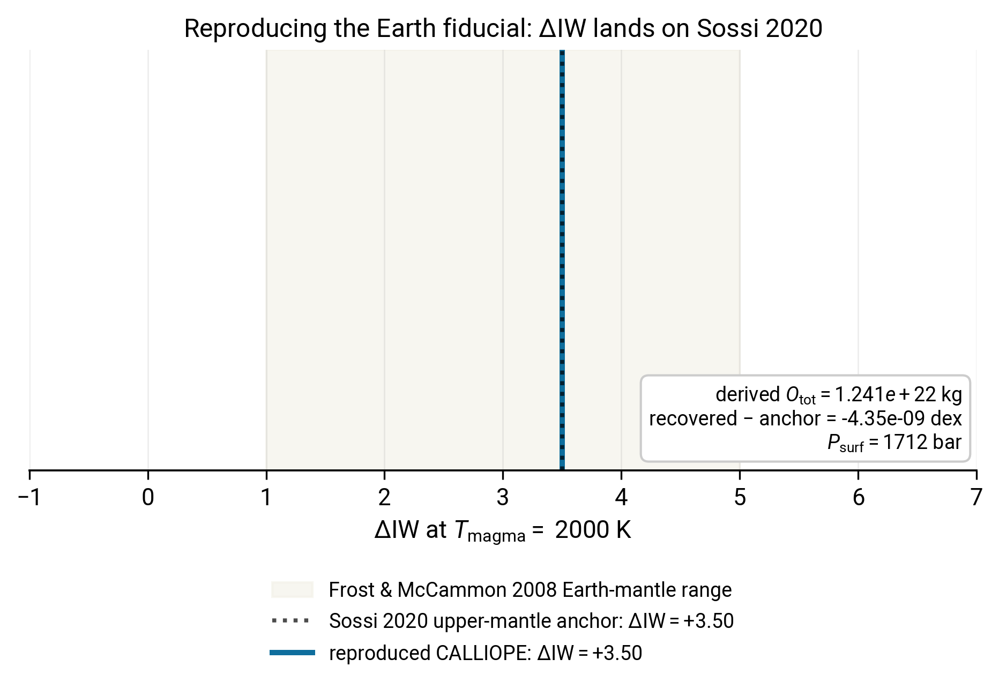

# Reproducing the Earth fiducial

The [Backend comparison](../Explanations/cross_backend_comparison.md) explanation page anchors all of its figures on one shared Earth scenario: Krijt+2023 BSE H/C/N/S, $T_\mathrm{magma} = 2000$ K, $\Phi = 1$, and a volatile O reference of $1.24 \times 10^{22}$ kg derived to put CALLIOPE on the Sossi 2020 $\Delta\mathrm{IW} = +3.5$ Earth upper-mantle anchor. This tutorial walks you through reproducing those numbers from scratch so you can verify the docs are still consistent with the current solver, and so you have the workflow on hand when you want to anchor your own runs to a literature value.

By the end of it you will:

- have reproduced the $O = 1.24 \times 10^{22}$ kg volatile-O reference from the Krijt H/C/N/S budget;
- have verified that the authoritative-O entry point recovers $\Delta\mathrm{IW} = +3.5$ from that O reference to within solver tolerance;
- understand why the buffered call at high $\Delta\mathrm{IW}$ + carbon-rich BSE needs a tight `p_guess` (it has a spurious secondary basin without it).

You should already have completed [Two-mode round-trip](two_modes.md), which introduces both entry points.

## Step 1: pin the Krijt+2023 H/C/N/S budget

```python
import warnings

from calliope.constants import volatile_species
from calliope.solve import (
    equilibrium_atmosphere,
    equilibrium_atmosphere_authoritative_O,
)

planet  = {'M_mantle': 4.03e24, 'gravity': 9.81, 'radius': 6.371e6}
T_magma = 2000.0
diw_anchor = 3.5   # Sossi et al. 2020 Earth upper-mantle estimate

# Krijt et al. 2023 PPVII Tables 1 and 2 BSE row (kg).
earth_hcns = {'H': 5.6e20, 'C': 3.1e21, 'N': 3.7e19, 'S': 1.0e21}
```

## Step 2: derive the volatile-O reference via buffered mode

This is the step that needs the tight `p_guess`.

Without one, the buffered solver at high $\Delta\mathrm{IW}$ with a carbon-rich BSE inventory has two basins: the physical CO$_2$-dominated one at $P_\mathrm{surf} \approx 1712$ bar and a spurious H$_2$O-free one at $P_\mathrm{surf} \approx 1497$ bar. The Monte-Carlo restart lands in the spurious basin roughly 1 time in 5, which is too often for a reproducible tutorial.

A `p_guess` near the CO$_2$-dominated basin pins the right answer reliably:

```python
ddict = {**planet, 'T_magma': T_magma, 'Phi_global': 1.0,
         'fO2_shift_IW': diw_anchor}
for sp in volatile_species:
    ddict[f'{sp}_included']    = 1
    ddict[f'{sp}_initial_bar'] = 0.0

# Pin the canonical CO2-dominated basin. Numbers are approximate; the
# solver tightens them to the converged values during fsolve.
canonical_guess = {'H2O': 5.0, 'CO2': 1500.0, 'N2': 3.0, 'S2': 1e-3}

with warnings.catch_warnings():
    warnings.simplefilter('ignore')
    buf = equilibrium_atmosphere(
        earth_hcns, ddict, p_guess=canonical_guess, print_result=False,
    )

print(f'derived O_kg_total = {buf["O_kg_total"]:.3e} kg')
print(f'P_surf            = {buf["P_surf"]:.0f} bar')
print(f'H2O               = {buf["H2O_bar"]:.2f} bar')
print(f'CO2               = {buf["CO2_bar"]:.0f} bar')
```

Expected output:

```
derived O_kg_total = 1.241e+22 kg
P_surf            = 1712 bar
H2O               = 5.59 bar
CO2               = 1499 bar
```

This is the same number stored as `EARTH_VOLATILE_O_REF_KG` in `scripts/cross_backend/inventories.py` and quoted on the backend-comparison page.

!!! note "Why a CO$_2$-dominated atmosphere here, not steam?"
    Earth's BSE C / H mass ratio in the Krijt+2023 budget is $\sim 5.5$. At $\Delta\mathrm{IW} = +3.5$ both elements oxidise; with so much more carbon than hydrogen, CO$_2$ dominates the atmosphere by mass even though H$_2$O is the more familiar magma-ocean atmospheric species. See [Speciation phase diagram](phase_diagram.md) for the same regime mapped across $(T, \Delta\mathrm{IW})$.

## Step 3: round-trip through authoritative-O

Feed the derived O budget into the authoritative-O entry point and verify that it recovers the input $\Delta\mathrm{IW}$ within solver tolerance:

```python
target = dict(earth_hcns); target['O'] = buf['O_kg_total']
p_guess = {s: float(buf[f'{s}_bar']) for s in ('H2O', 'CO2', 'N2', 'S2')}

with warnings.catch_warnings():
    warnings.simplefilter('ignore')
    auth = equilibrium_atmosphere_authoritative_O(
        target, ddict, p_guess=p_guess, fO2_hint=diw_anchor,
        print_result=False,
    )

residual = auth['fO2_shift_derived'] - diw_anchor
print(f'recovered Delta-IW = {auth["fO2_shift_derived"]:+.4f}')
print(f'residual           = {residual:+.2e} dex')
```

Expected output: `residual = -4.35e-09 dex`, i.e. essentially zero. The full provenance chain (Krijt H/C/N/S → buffered mode → derived O → authoritative-O → Delta-IW) closes at the Sossi 2020 anchor.

## The goal of this tutorial



*Earth fiducial reproduced from scratch. The cream band is the Frost & McCammon (2008) empirical Earth-mantle range, $\Delta\mathrm{IW} \in [+1, +5]$. The dotted vertical is the Sossi et al. (2020) upper-mantle anchor, $\Delta\mathrm{IW} = +3.50$. The solid line is the CALLIOPE recovered value after the buffered → authoritative-O round-trip. The summary box reports the derived O budget, the absolute closure residual (a few parts in $10^9$), and the converged surface pressure. The reproduced CALLIOPE line sits exactly on the Sossi anchor, as it should: the entire workflow is constructed to land on this value.*

If your reproduced figure does not show the CALLIOPE line on the Sossi anchor, the most likely cause is that you skipped the `canonical_guess` in Step 2 and the buffered solver landed in the spurious H$_2$O-free basin. Add the `p_guess` and re-run.

## Where to go next

- For the full atmosphere-side details (every partial pressure at this fiducial), open the [First-run reference figure](firstrun.md#compare-your-output-against-the-reference) and substitute these inputs.
- For how this fiducial sits inside the cross-backend story (CALLIOPE vs atmodeller at the same inputs), read the [Backend comparison](../Explanations/cross_backend_comparison.md) explanation page.
- For the planetary case study that contrasts Earth-BSE with a very different inventory, read the next tutorial: [Mars-like atmosphere](mars_fiducial.md).

## Reproducing the figure

Generated by [`scripts/tutorials/fig_earth_fiducial.py`](https://github.com/FormingWorlds/CALLIOPE/blob/main/scripts/tutorials/fig_earth_fiducial.py). Re-run with `python -m scripts.tutorials.fig_earth_fiducial` from the repository root.
