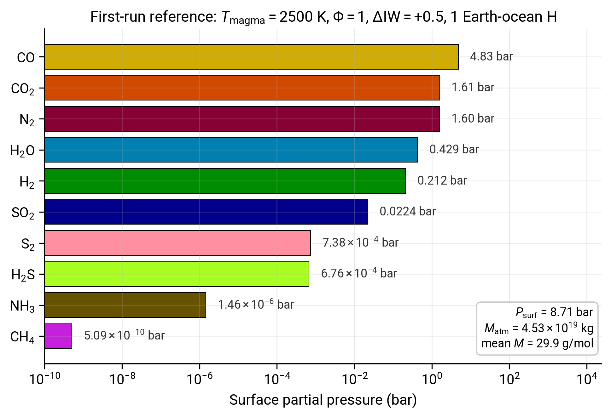

# First run

This tutorial walks an Earth-like volatile inventory through CALLIOPE and visualises the resulting atmosphere. By the end of it you will have called the equilibrium solver, read the output dictionary, and produced a partial-pressure plot you can adapt for your own work.

You should already have CALLIOPE installed (see [Installation](../How-to/installation.md)) and have read the [Configuration](../How-to/configuration.md) page so the dictionary keys feel familiar.

## Step 1: build the input

Open a fresh Python script (or notebook) and assemble the magma-ocean state:

```python
import numpy as np
import matplotlib.pyplot as plt

from calliope.constants import volatile_species, dict_colors
from calliope.solve import equilibrium_atmosphere, get_target_from_params

ddict = {
    # planet
    'M_mantle': 4.03e24,    # kg, Earth mantle mass
    'gravity':  9.81,       # m s-2
    'radius':   6.371e6,    # m

    # magma ocean state
    'T_magma':      2500.0,  # K, hot magma ocean
    'Phi_global':   1.0,     # fully molten
    'fO2_shift_IW': 0.5,     # illustrative value: between IW (Bower+2022 use
                             # IW and IW+4 in their grid) and Sossi+2020's
                             # +3.5 estimate for Earth's surface mantle

    # bulk composition (Earth-ocean H, Earth-like C/H, primitive N and S)
    'hydrogen_earth_oceans': 1.0,
    'CH_ratio':              0.1,
    'nitrogen_ppmw':         2.0,
    'sulfur_ppmw':           200.0,
}

for sp in volatile_species:
    ddict[f'{sp}_included']    = 1     # include all 11 species
    ddict[f'{sp}_initial_bar'] = 0.0   # zero, not used in this mode (only
                                       # consulted by get_target_from_pressures)
```

!!! note "What these numbers mean"
    `hydrogen_earth_oceans = 1.0` corresponds to $\sim 1.55 \times 10^{20}$ kg of H, which the wrapper translates via `H_kg = N_ocean_moles * ocean_moles * molar_mass['H2']`. `CH_ratio = 0.1` is a mass ratio chosen to roughly match estimates of Earth's bulk silicate Earth C/H. `nitrogen_ppmw = 2.0` matches the Wang et al. (2018)[^cite-wang2018] primitive-mantle estimate that Nicholls et al. (2024)[^cite-nicholls2024] used as their fiducial value.

## Step 2: build the elemental targets and solve

```python
target = get_target_from_params(ddict)
print('Target inventories [kg]:')
for el, kg in target.items():
    print(f'  {el}: {kg:.3e}')

result = equilibrium_atmosphere(target, ddict, print_result=False)
```

The first call may take a few seconds because CALLIOPE's Monte-Carlo initial-guess generator typically needs 10-50 restarts to find the right basin without a warm start. Subsequent calls with `p_guess=` from the previous result complete in tens of milliseconds.

## Step 3: read the result

```python
print(f"Surface pressure : {result['P_surf']:8.2f} bar")
print(f"Atmosphere mass  : {result['M_atm']:.3e} kg")
print(f"Mean mol. mass   : {result['atm_kg_per_mol'] * 1e3:6.3f} g/mol\n")

print('Surface partial pressures:')
for sp in sorted(volatile_species, key=lambda s: -result[f'{s}_bar']):
    p = result[f'{sp}_bar']
    x = result[f'{sp}_vmr']
    if p > 1e-6:
        print(f'  {sp:5s}: {p:9.3e} bar  (VMR {x:.3e})')
```

For the inputs above (1 ocean H, $\Delta\mathrm{IW} = +0.5$, $T = 2500$ K, $\Phi = 1$) you should see a multi-thousand-bar atmosphere dominated by H$_2$O, with sub-percent CO$_2$ and traces of CO, H$_2$, and S species. The exact values depend on the solubility-law defaults; see [Solubility laws](../Explanations/solubility.md) for what each species uses.

## Step 4: verify mass balance

The solver returns the final residual for each element (in kg). They should be small relative to the input target:

```python
print('\nMass-balance residuals:')
for el in ['H', 'C', 'N', 'S']:
    res = result[f'{el}_res']
    rel = res / target[el]
    print(f'  {el}: {res:+.3e} kg  ({rel:+.2e} relative)')
```

A successful solve has $|\text{res}_e| / \text{target}_e \lesssim 10^{-5}$ for every element. Larger residuals mean the tolerance was loose or the solver bottomed out on a local minimum; tighten `rtol` and re-run, or pass a `p_guess` from a known-good run.

## Step 5: plot

O$_2$ is set diagnostically by the $f_{\mathrm{O}_2}$ buffer (it is not solved for), so the bar chart focuses on the ten reactive species:

```python
species_to_plot = ['H2O', 'CO2', 'H2', 'CO', 'CH4', 'N2', 'NH3', 'S2', 'SO2', 'H2S']
pressures = np.array([result[f'{sp}_bar'] for sp in species_to_plot])
colors = [dict_colors[sp] for sp in species_to_plot]

fig, ax = plt.subplots(figsize=(7, 4))
ax.bar(species_to_plot, pressures, color=colors, edgecolor='black', linewidth=0.5)
ax.set_yscale('log')
ax.set_ylabel('Surface partial pressure (bar)')
ax.set_title(rf'$T = {ddict["T_magma"]:.0f}$ K, $\Phi = {ddict["Phi_global"]}$, $\Delta$IW $ = {ddict["fO2_shift_IW"]:+.1f}$')
ax.set_ylim(1e-6, 1e4)
ax.grid(axis='y', which='both', alpha=0.3)
fig.tight_layout()
fig.savefig('first_run.pdf')
plt.show()
```

`dict_colors` from `calliope.constants` is the colour scheme used across the PROTEUS ecosystem so figures stay visually consistent.

### Compare your output against the reference

The figure below is the same Earth-like inputs run through `equilibrium_atmosphere` on a clean CALLIOPE install. Your numbers should reproduce these to within a few percent (the residual reflects Monte-Carlo restart variability, not a calibration issue).



*Reference output for the first-run inputs. Species ordered top-to-bottom by partial pressure. The summary box top-right shows the three aggregate diagnostics from Step 3 ($P_\mathrm{surf}$, $M_\mathrm{atm}$, mean molar mass).*

The five large reservoirs (CO, N$_2$, CO$_2$, H$_2$, H$_2$O all between $\sim 0.2$ and $\sim 5$ bar) account for essentially the entire $\sim 9$ bar atmosphere; the four trace species (SO$_2$, H$_2$S, S$_2$, NH$_3$) sit two to seven orders of magnitude lower; CH$_4$ is effectively absent at this temperature. If your output disagrees by more than a factor of $\sim 2$ on a major species or by orders of magnitude on the speciation ordering, recheck the `ddict` keys against the snippet above. The script that produces this reference figure is checked in at [`scripts/tutorials/fig_firstrun_reference.py`](https://github.com/FormingWorlds/CALLIOPE/blob/main/scripts/tutorials/fig_firstrun_reference.py) and can be re-run with `python -m scripts.tutorials.fig_firstrun_reference` from the repository root.

## Step 6: sweep one parameter

Repeat the solve along a grid of $\Delta\mathrm{IW}$ to see the redox dependence directly. Reuse the previous solution as the warm start each time:

```python
diw_grid = np.linspace(-5, +5, 21)
p_dict = {sp: [] for sp in species_to_plot}
p_guess = None

for diw in diw_grid:
    ddict['fO2_shift_IW'] = diw
    target = get_target_from_params(ddict)
    result = equilibrium_atmosphere(target, ddict, p_guess=p_guess, print_result=False)
    for sp in species_to_plot:
        p_dict[sp].append(result[f'{sp}_bar'])
    # warm start the next solve with the four primaries
    p_guess = {s: result[f'{s}_bar'] for s in ('H2O', 'CO2', 'N2', 'S2')}

fig, ax = plt.subplots(figsize=(7, 5))
for sp in species_to_plot:
    ax.plot(diw_grid, p_dict[sp], color=dict_colors[sp], label=sp, lw=2)
ax.set_yscale('log')
ax.set_xlabel(r'$\Delta\mathrm{IW}$ ($\log_{10}$ shift from iron-wüstite)')
ax.set_ylabel('Partial pressure (bar)')
ax.set_ylim(1e-6, 1e4)
ax.legend(ncol=2, fontsize=8, loc='best')
ax.grid(which='both', alpha=0.3)
fig.tight_layout()
fig.savefig('redox_sweep.pdf')
plt.show()
```

The expected qualitative behaviour, consistent with Bower et al. (2022)[^cite-bower2022] Section 3 and Nicholls et al. (2024)[^cite-nicholls2024] Figure 6:

- At $\Delta\mathrm{IW} \le -1$ (reducing), H$_2$ and CO dominate; H$_2$O and CO$_2$ collapse;
- Around $\Delta\mathrm{IW} \approx 0$, the H$_2$O/H$_2$ and CO$_2$/CO ratios are of order unity;
- At $\Delta\mathrm{IW} \ge +2$ (oxidising), H$_2$O and CO$_2$ dominate; H$_2$ and CO are sub-percent.

S$_2$ stays roughly constant (inventory-controlled), while SO$_2$ rises and H$_2$S falls with increasing $\Delta\mathrm{IW}$.

## Where to go next

- For the equations behind the redox couples, read [Equilibrium chemistry](../Explanations/equilibrium_chemistry.md).
- For the solubility laws and their references, read [Solubility laws](../Explanations/solubility.md).
- For the mass-balance system that ties the partial pressures to the elemental inventory, read [Mass balance & solver](../Explanations/mass_balance.md).
- For the PROTEUS-coupled invocation pattern, read [Coupling to PROTEUS (how-to)](../How-to/proteus_coupling.md).

[^cite-bower2022]: D. J. Bower, K. Hakim, P. A. Sossi, P. Sanan, *[Retention of water in terrestrial magma oceans and carbon-rich early atmospheres](https://doi.org/10.3847/PSJ/ac5fb1)*, The Planetary Science Journal, 3(4), 93, 2022. [SciX](https://scixplorer.org/abs/2022PSJ.....3...93B/abstract).
[^cite-nicholls2024]: H. Nicholls, T. Lichtenberg, D. J. Bower, R. Pierrehumbert, *[Magma ocean evolution at arbitrary redox state](https://doi.org/10.1029/2024JE008576)*, Journal of Geophysical Research: Planets, 129, e2024JE008576, 2024. [SciX](https://scixplorer.org/abs/2024JGRE..12908576N/abstract).
[^cite-wang2018]: H. S. Wang, C. H. Lineweaver, T. R. Ireland, *[The elemental abundances (with uncertainties) of the most Earth-like planet](https://doi.org/10.1016/j.icarus.2017.08.024)*, Icarus, 299, 460–474, 2018. [SciX](https://scixplorer.org/abs/2018Icar..299..460W/abstract).
