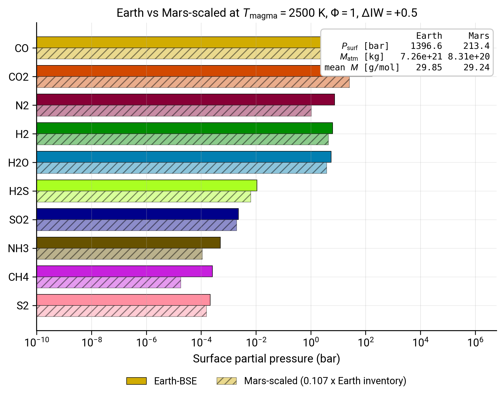

# Mars-like atmosphere

CALLIOPE is not Earth-specific. Anything in the planet parameter dictionary (`M_mantle`, `gravity`, `radius`) is a knob the user can change, and the solubility laws are calibrated against terrestrial-basalt melts that extrapolate reasonably to other rocky bodies. This tutorial swaps in Mars-like planetary parameters and a mass-scaled inventory, runs the same chemistry, and reads off how the atmosphere differs.

By the end of it you will:

- have run CALLIOPE on a non-Earth planet;
- have a side-by-side comparison of Earth-BSE and Mars-scaled atmospheres at the same redox and temperature;
- know which atmospheric properties are inventory-driven (per-species partial pressures) and which are structure-driven (surface pressure, atmospheric mass).

You should already have completed [First run](firstrun.md). The other tutorials are not strictly required but make the figure easier to interpret.

!!! note "On the choice of 'Mars-scaled' inventory"
    The Mars BSE H/C/N/S inventory is much less well-constrained than Earth's. To keep this tutorial reproducible without committing to a specific Mars-petrology estimate, we scale the Krijt et al. 2023[^cite-krijt2023] Earth BSE inventory uniformly by Mars's mass-ratio to Earth ($0.107$). The result is a "Mars-mass terrestrial body with Earth-like volatile fractions". The contrast you read off the figure is therefore primarily driven by Mars's smaller gravity and mantle mass, not by a fundamentally different chemistry. For real Mars BSE work, swap in a literature Mars-mantle composition (e.g. the classical Wänke & Dreibus 1988[^cite-waenkedreibus1988] reduced-chondrite estimate) using the same workflow.

## Step 1: define both planets

```python
import warnings

import numpy as np

from calliope.constants import volatile_species
from calliope.solve import equilibrium_atmosphere

earth = {
    'name': 'Earth',
    'planet': {'M_mantle': 4.03e24, 'gravity': 9.81, 'radius': 6.371e6},
    'hcns':   {'H': 5.6e20, 'C': 3.1e21, 'N': 3.7e19, 'S': 1.0e21},
}

mass_ratio = 0.107  # Mars / Earth
mars = {
    'name': 'Mars-scaled',
    'planet': {'M_mantle': 5.03e23, 'gravity': 3.71, 'radius': 3.39e6},
    'hcns':   {k: v * mass_ratio for k, v in earth['hcns'].items()},
}

T_magma = 2500.0
diw     = 0.5
phi     = 1.0
```

## Step 2: solve each planet's atmosphere

```python
def solve_atmosphere(cfg):
    ddict = {**cfg['planet'], 'T_magma': T_magma, 'Phi_global': phi,
             'fO2_shift_IW': diw}
    for sp in volatile_species:
        ddict[f'{sp}_included']    = 1
        ddict[f'{sp}_initial_bar'] = 0.0
    with warnings.catch_warnings():
        warnings.simplefilter('ignore')
        return equilibrium_atmosphere(cfg['hcns'], ddict, print_result=False)

earth_out = solve_atmosphere(earth)
mars_out  = solve_atmosphere(mars)

print(f'Earth: P_surf = {earth_out["P_surf"]:6.1f} bar, M_atm = {earth_out["M_atm"]:.2e} kg')
print(f'Mars : P_surf = {mars_out["P_surf"]:6.1f} bar, M_atm = {mars_out["M_atm"]:.2e} kg')
```

You should see:

```
Earth: P_surf = 1396.6 bar, M_atm = 7.26e+21 kg
Mars : P_surf =  213.4 bar, M_atm = 8.31e+20 kg
```

Two things are worth noticing:

- The Mars atmosphere has about $1/9$ the mass of Earth's, in line with the $0.107$ inventory scaling. The chemistry is roughly mass-linear at this regime.
- The Mars surface pressure is only $1/7$ of Earth's, not $1/9$, because the smaller gravity ($3.71$ m s$^{-2}$ vs $9.81$ m s$^{-2}$) trades against the smaller atmospheric mass: $P_\mathrm{surf} = g M_\mathrm{atm} / (4\pi R^2)$, so the gravity ratio (factor $0.38$) partly compensates the mass ratio (factor $0.11$).

## Step 3: plot the comparison

```python
import matplotlib.pyplot as plt

from calliope.constants import dict_colors

species = ['H2O', 'CO2', 'H2', 'CO', 'CH4',
           'N2', 'NH3', 'S2', 'SO2', 'H2S']

# Sort by Earth pressure descending; Mars uses the same order so the
# comparison is bar-by-bar.
order = sorted(species, key=lambda sp: -earth_out[f'{sp}_bar'])
earth_p = np.array([earth_out[f'{sp}_bar'] for sp in order])
mars_p  = np.array([mars_out[f'{sp}_bar']  for sp in order])

fig, ax = plt.subplots(figsize=(8.0, 5.4))
y = np.arange(len(order)) * 1.8
h = 0.7
ax.barh(y - h / 2, earth_p, height=h,
        color=[dict_colors[sp] for sp in order],
        edgecolor='black', linewidth=0.5, label='Earth-BSE')
ax.barh(y + h / 2, mars_p, height=h,
        color=[dict_colors[sp] for sp in order], alpha=0.45,
        edgecolor='black', linewidth=0.5, hatch='///',
        label='Mars-scaled (0.107 x Earth inventory)')
ax.set_xscale('log')
ax.set_yticks(y)
ax.set_yticklabels(order)
ax.invert_yaxis()
ax.set_xlabel('Surface partial pressure (bar)')
ax.legend(loc='upper center', bbox_to_anchor=(0.5, -0.12), ncol=2, frameon=False)
fig.tight_layout()
fig.savefig('mars_vs_earth.pdf')
```

## The goal of this tutorial



*Surface partial pressures at $T_\mathrm{magma} = 2500$ K, $\Delta\mathrm{IW} = +0.5$, $\Phi = 1$ on two bodies. Solid bars: Earth-BSE Krijt+2023 inventory on Earth planetary parameters. Hatched bars: same inventory scaled by Mars / Earth mass ratio (0.107) on Mars planetary parameters. Species ordered top-to-bottom by Earth partial pressure. Summary box top-right reports the three aggregate diagnostics for both bodies.*

The figure makes one pedagogical point cleanly: at fixed redox and temperature, the per-species partial pressures on the Mars-scaled body track Earth's by roughly the same factor across the redox-relevant species (CO, CO$_2$, N$_2$, H$_2$, H$_2$O). The dominant-species *ordering* is preserved: CO dominates on both bodies because the C / H mass ratio in the inventory is identical (we scaled uniformly). What changes is the absolute scale.

This is the right intuition to carry into more sophisticated planetary work. A genuinely different *composition* (different C / H, different volatile-element fractionation, a depleted N or S budget) will shift the dominant species and break the parallel-bar pattern. A genuinely different *structure* (Mars-mass body with Earth-mass mantle, or a Venus-mass body with Mars-fraction volatiles) will shift the surface pressure without shifting the speciation. The two effects separate cleanly because CALLIOPE's chemistry depends on element budgets, not on how those budgets were divided among Earth-mass and Mars-mass bodies.

A third change, and the one likely most relevant to real Mars work, would substantially break the parallel-bar pattern: *the mantle redox state*. The shergottite-based estimate of Mars's upper-mantle $f_{\mathrm{O}_2}$ from Wadhwa 2001[^cite-wadhwa2001] spans roughly $\Delta\mathrm{IW} \approx 0$ to $\Delta\mathrm{IW} \approx +3$, more reducing than the Sossi 2020 $\Delta\mathrm{IW} = +3.5$ Earth upper-mantle anchor used in this tutorial. The [Speciation phase diagram](phase_diagram.md) tutorial shows that at $\Delta\mathrm{IW} \lesssim +2$ the dominant species at this temperature flips from CO$_2$ to CO, and that H$_2$O and CO$_2$ drop sharply below the CO / H$_2$ pair. A Mars run that takes the petrologically motivated $\Delta\mathrm{IW} \sim +1$ instead of the $\Delta\mathrm{IW} = +0.5$ used here would therefore see substantially less H$_2$O and a much more reducing atmosphere overall, separately from the planetary-structure scaling explored on this page.

## Where to go next

- Swap in a literature Mars BSE inventory (Wänke & Dreibus 1988[^cite-waenkedreibus1988]) in the `mars['hcns']` dict and re-run; compare the per-species shift to the uniform-scaling result.
- Reduce the redox to $\Delta\mathrm{IW} = -3$ to look at a Mercury-like reducing endmember on the same Mars-mass body; the dominant species will switch.
- Read [Equilibrium chemistry](../Explanations/equilibrium_chemistry.md) for the reactions that hold across all of these scenarios.

## Reproducing the figure

Generated by [`scripts/tutorials/fig_mars_fiducial.py`](https://github.com/FormingWorlds/CALLIOPE/blob/main/scripts/tutorials/fig_mars_fiducial.py). Re-run with `python -m scripts.tutorials.fig_mars_fiducial` from the repository root.

[^cite-krijt2023]: S. Krijt, M. Kama, M. McClure, J. Teske, E. A. Bergin, O. Shorttle, K. J. Walsh, S. N. Raymond, *Chemical habitability: supply and retention of life's essential elements during planet formation*, in Protostars and Planets VII, S. Inutsuka, Y. Aikawa, T. Muto, K. Tomida, M. Tamura, eds., Astronomical Society of the Pacific Conference Series, 534, 1031, 2023.
[^cite-waenkedreibus1988]: H. Wänke, G. Dreibus, *[Chemical composition and accretion history of terrestrial planets](https://doi.org/10.1098/rsta.1988.0067)*, Philosophical Transactions of the Royal Society A, 325(1587), 545, 1988.
[^cite-wadhwa2001]: M. Wadhwa, *[Redox state of Mars' upper mantle and crust from Eu anomalies in shergottite pyroxenes](https://doi.org/10.1126/science.1057594)*, Science, 291(5508), 1527, 2001.
