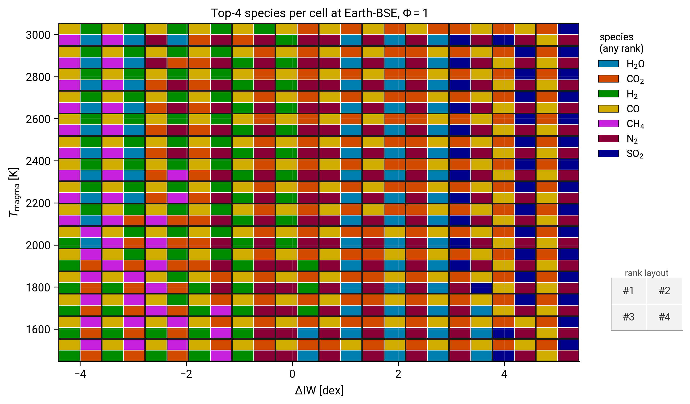

# Speciation phase diagram

The first-run tutorial swept one parameter ($\Delta\mathrm{IW}$) at fixed temperature. Real magma oceans cool and re-equilibrate, so the dominant atmospheric species can shift as both $T$ and $\Delta\mathrm{IW}$ evolve. This tutorial generalises the 1D sweep to a 2D grid and builds a *speciation phase diagram*: at every $(T, \Delta\mathrm{IW})$ point, what are the four most abundant volatile species, and how does that quartet shift across the plane?

By the end of it you will:

- have run CALLIOPE on a 2D parameter grid using a warm-started serpentine sweep so the wall-time stays manageable;
- have produced the top-4 species map on the front of this page (each cell subdivided into four quadrants showing the species at ranks 1 through 4);
- understand why Earth-BSE atmospheres are CO- or CO$_2$-dominated rather than H$_2$O-dominated in the magma-ocean regime, and how the second through fourth species shift in lockstep with the dominant one.

You should already have completed the [First run](firstrun.md) tutorial so the `equilibrium_atmosphere` call signature is familiar.

## Step 1: set up the sweep

```python
import warnings

import numpy as np

from calliope.constants import volatile_species
from calliope.solve import equilibrium_atmosphere

planet = {'M_mantle': 4.03e24, 'gravity': 9.81, 'radius': 6.371e6}

# Earth-BSE H/C/N/S in kg (Krijt et al. 2023, PPVII Tables 1 and 2).
earth_hcns = {'H': 5.6e20, 'C': 3.1e21, 'N': 3.7e19, 'S': 1.0e21}

T_grid   = np.linspace(1500.0, 3000.0, 15)
diw_grid = np.linspace(  -4.0,    5.0, 12)

species_to_report = ['H2O', 'CO2', 'O2', 'H2', 'CO', 'CH4',
                     'N2',  'NH3', 'S2', 'SO2', 'H2S']

pressures = np.full((T_grid.size, diw_grid.size, len(species_to_report)), np.nan)
rank_idx  = np.full((T_grid.size, diw_grid.size, 4), -1, dtype=int)
P_total   = np.full((T_grid.size, diw_grid.size), np.nan)


def base_ddict(T, diw):
    d = {**planet, 'T_magma': T, 'Phi_global': 1.0, 'fO2_shift_IW': diw}
    for sp in volatile_species:
        d[f'{sp}_included']    = 1
        d[f'{sp}_initial_bar'] = 0.0
    return d
```

In the loop below we keep the full partial-pressure vector at each grid point, not just the index of the dominant species, so the figure step can sort and pick the top four.

## Step 2: warm-start along $\Delta\mathrm{IW}$ at each $T$

Each call from cold takes about a second because the Monte-Carlo restart has to find a basin; with a `p_guess` from the previous call, subsequent solves complete in milliseconds. The cleanest schedule is a serpentine sweep: walk $\Delta\mathrm{IW}$ at fixed $T$, reset between rows.

```python
for iT, T in enumerate(T_grid):
    p_guess = None                              # cold-start each row
    for jd, diw in enumerate(diw_grid):
        ddict = base_ddict(float(T), float(diw))
        with warnings.catch_warnings():
            warnings.simplefilter('ignore')
            try:
                res = equilibrium_atmosphere(
                    earth_hcns, ddict, p_guess=p_guess, print_result=False,
                )
            except Exception:
                p_guess = None                  # invalidate guess on failure
                continue
        ps = np.array([res[f'{sp}_bar'] for sp in species_to_report])
        pressures[iT, jd] = ps
        order = np.argsort(ps)[::-1]
        rank_idx[iT, jd]  = order[:4]            # top-4 species indices
        P_total[iT, jd]   = float(res['P_surf'])
        # carry the four primary partial pressures forward as the next guess
        p_guess = {s: float(res[f'{s}_bar']) for s in ('H2O', 'CO2', 'N2', 'S2')}
```

A 15 × 12 grid runs in about 30 to 60 seconds on a modern laptop. The grid resolution is a tradeoff: fewer points runs faster but smears the redox boundary; more points sharpens the boundary but adds linearly to the wall time.

!!! tip "If a cell fails to converge"
    The solver can land in a secondary basin at extreme conditions. The `except` clause above invalidates the warm start so the next call cold-starts from a fresh Monte-Carlo draw. Failed cells show up as masked (white) in the figure rather than corrupting the colour map.

## Step 3: subdivide each cell into a top-4 quartet

Each grid cell is split into a 2 by 2 of sub-cells in reading order: top-left = rank 1 (dominant), top-right = rank 2, bottom-left = rank 3, bottom-right = rank 4. The pcolormesh below works on a doubled grid; the helper inserts a midpoint between every pair of cell edges so each original cell becomes four sub-cells.

```python
import matplotlib.pyplot as plt
from matplotlib.colors import ListedColormap
from matplotlib.patches import Patch

from calliope.constants import dict_colors

# Expand rank_idx into a 2 x 2 sub-grid per original cell. The (sub_T,
# sub_d) coordinates map to ranks 1..4 as documented above.
n_T, n_d = rank_idx.shape[:2]
expanded = np.full((2 * n_T, 2 * n_d), -1, dtype=int)
for iT in range(n_T):
    for jd in range(n_d):
        r1, r2, r3, r4 = rank_idx[iT, jd]
        expanded[2*iT + 1, 2*jd + 0] = r1     # top-left
        expanded[2*iT + 1, 2*jd + 1] = r2     # top-right
        expanded[2*iT + 0, 2*jd + 0] = r3     # bottom-left
        expanded[2*iT + 0, 2*jd + 1] = r4     # bottom-right

# Build a compact palette: only species that actually appear in any
# of the rank-1..rank-4 slots somewhere in the grid.
seen = sorted({int(v) for v in expanded.ravel() if v >= 0})
palette = [dict_colors[species_to_report[i]] for i in seen]
remap = {old: new for new, old in enumerate(seen)}
remapped = np.vectorize(lambda v: remap.get(int(v), -1))(expanded)

def edges_doubled(arr):
    s = arr[1] - arr[0]
    outer = np.concatenate([[arr[0] - 0.5*s],
                            0.5*(arr[:-1] + arr[1:]),
                            [arr[-1] + 0.5*s]])
    mids = 0.5 * (outer[:-1] + outer[1:])
    out = np.empty(2 * outer.size - 1)
    out[0::2] = outer; out[1::2] = mids
    return out

fig, ax = plt.subplots(figsize=(10.5, 5.8))
ax.pcolormesh(edges_doubled(diw_grid), edges_doubled(T_grid),
              np.ma.masked_less(remapped, 0),
              cmap=ListedColormap(palette),
              shading='flat', edgecolors='white', linewidth=0.35)
ax.set_xlabel(r'$\Delta$IW [dex]')
ax.set_ylabel(r'$T_\mathrm{magma}$ [K]')
ax.set_title('Top-4 species per cell at Earth-BSE')

handles = [Patch(facecolor=palette[k], edgecolor='k', linewidth=0.4,
                 label=species_to_report[seen[k]]) for k in range(len(seen))]
ax.legend(handles=handles, loc='upper left', bbox_to_anchor=(1.02, 1.0),
          title='species (any rank)', frameon=False)
fig.savefig('phase_diagram.pdf')
```

## The goal of this tutorial



*Top-4 volatile species per cell in $(T_\mathrm{magma}, \Delta\mathrm{IW})$ at the Earth-BSE Krijt et al. 2023 [^cite-krijt2023] H/C/N/S budget and $\Phi = 1$. Each grid cell is subdivided 2 by 2 in reading order (top-left = rank 1, top-right = rank 2, bottom-left = rank 3, bottom-right = rank 4) so the four most abundant species at that simulation point are visible at a glance. The redox boundary in the dominant species (top-left quadrant) separates a CO-dominated reducing regime (left) from a CO$_2$-dominated oxidising regime (right); the rank 2 to rank 4 quadrants reveal how H$_2$, H$_2$O, N$_2$, and SO$_2$ swap positions across the same boundary. A small CH$_4$ patch appears near $T \sim 1900$ K at the most reducing edge of the grid where methane synthesis becomes briefly thermodynamically competitive. At the hot, oxidising corner ($T \gtrsim 2700$ K and $\Delta\mathrm{IW} \gtrsim +4$) molecular O$_2$ itself enters the top four, reaching rank 2 at $T = 3000$ K, $\Delta\mathrm{IW} = +5$ (about 15% of $P_\mathrm{surf}$).*

The result that may surprise a reader who thinks of magma-ocean atmospheres as "steam-dominated" is that on the *Earth* BSE inventory carbon sets the dominant species, even though hydrogen outnumbers carbon by molar count (5.6 $\times 10^{23}$ mol H against 2.6 $\times 10^{23}$ mol C). The cause is not the bulk inventory ratio but melt solubility: H$_2$O is roughly two orders of magnitude more soluble in silicate melt than CO$_2$, so at $\Phi = 1$ most of the H budget stays dissolved while most of the C outgases (Bower et al. 2022 [^cite-bower2022] Section 3). A water-dominated atmosphere needs either a much higher H budget (gas-giant-like) or a much lower C budget (volatile-poor / dehydrated body); the planetary case study tutorial illustrates one such contrast.

The CO / CO$_2$ phase boundary shifts from $\Delta\mathrm{IW} \approx +1$ at $T = 1500$ K to $\Delta\mathrm{IW} \approx +3$ at $T = 3000$ K, roughly $1.5$ dex of $T$-dependence across the grid. The shift reflects the temperature dependence of the CO + 1/2 O$_2$ $\rightleftharpoons$ CO$_2$ equilibrium constant (entropy favours CO at high $T$). At any given $T$, the boundary is sharp: cross it and CO$_2$ takes over within a single grid cell.

A second feature lives at the hot, oxidising corner: molecular O$_2$ stops being a trace gas. The IW-buffer fugacity climbs steeply with temperature, the Fischer buffer rising about nine orders of magnitude from $\log_{10} f_{\mathrm{O}_2} \approx -11.6$ at $1500$ K to $\approx -2.5$ at $3000$ K, so a fixed $\Delta\mathrm{IW}$ offset maps to a far higher absolute O$_2$ fugacity at high $T$. At $T = 3000$ K and $\Delta\mathrm{IW} = +5$ the O$_2$ partial pressure reaches a few hundred bar, about $15\%$ of $P_\mathrm{surf}$ and second only to CO$_2$. Below $\sim 2700$ K, or at reducing $\Delta\mathrm{IW}$, O$_2$ falls back below the four reported species and does not appear; this is why the cooler and more reducing parts of the grid show no green.

## Where to go next

- For a finer look at the speciation transitions across $\Delta\mathrm{IW}$ at one $T$, return to [First run](firstrun.md) Step 6 and use a denser $\Delta\mathrm{IW}$ grid with this tutorial's warm-start pattern.
- For how PROTEUS handles repeated CALLIOPE calls across a time-stepped simulation, read the next tutorial: [Coupled-loop driver](coupled_loop.md).
- For the chemistry behind the dominant-species shifts, read [Equilibrium chemistry](../Explanations/equilibrium_chemistry.md).

## Reproducing the figure

Generated by [`scripts/tutorials/fig_phase_diagram.py`](https://github.com/FormingWorlds/CALLIOPE/blob/main/scripts/tutorials/fig_phase_diagram.py). Re-run with `python -m scripts.tutorials.fig_phase_diagram` from the repository root.

 [^cite-bower2022]: D. J. Bower, K. Hakim, P. A. Sossi, P. Sanan, *[Retention of water in terrestrial magma oceans and carbon-rich early atmospheres](https://doi.org/10.3847/PSJ/ac5fb1)*, The Planetary Science Journal, 3(4), 93, 2022.
 [^cite-krijt2023]: S. Krijt, M. Kama, M. McClure, J. Teske, E. A. Bergin, O. Shorttle, K. J. Walsh, S. N. Raymond, *Chemical habitability: supply and retention of life's essential elements during planet formation*, in Protostars and Planets VII, S. Inutsuka, Y. Aikawa, T. Muto, K. Tomida, M. Tamura, eds., Astronomical Society of the Pacific Conference Series, 534, 1031, 2023.
