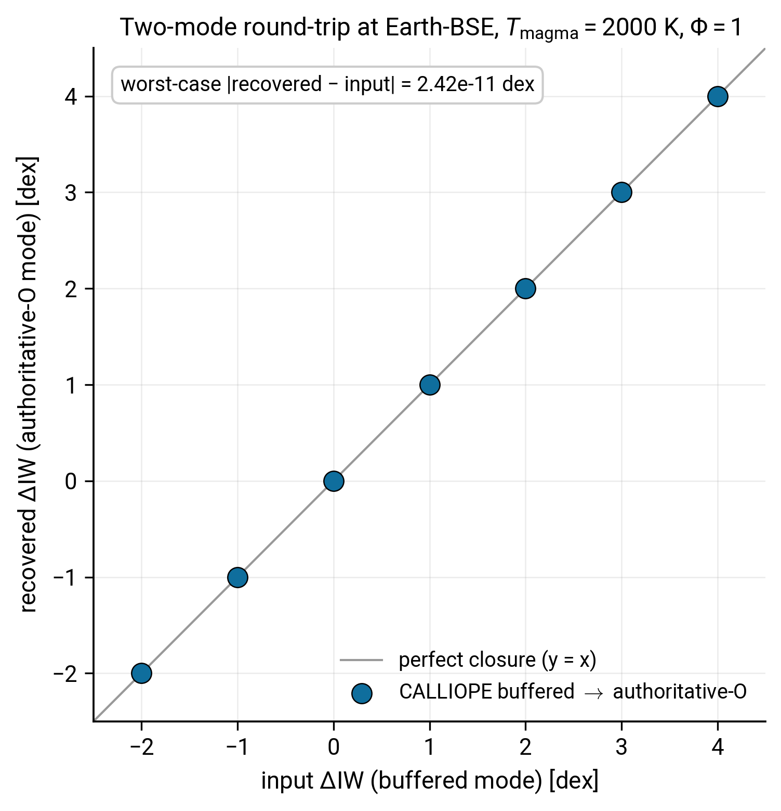

# Two-mode round-trip

CALLIOPE has two equilibrium-chemistry entry points that share the same physics but differ in which quantity is the input and which is the unknown. This tutorial walks you through both and shows that they are dual formulations of the same closure: feed the output of one into the other and you recover the original input.

By the end of it you will:

- have called both `equilibrium_atmosphere` (buffered mode) and `equilibrium_atmosphere_authoritative_O` (authoritative-O mode);
- know which key in the result dictionary to read from each;
- have produced the round-trip closure plot that opens this page.

You should already have completed the [First run](firstrun.md) tutorial, which uses buffered mode only.

## The two entry points in one sentence each

- **Buffered mode**: you supply $\Delta\mathrm{IW}$ via `ddict['fO2_shift_IW']`, the solver returns partial pressures and `O_kg_total` as a derived quantity.
- **Authoritative-O mode**: you supply the total volatile O mass via `target_d['O']`, the solver returns partial pressures and `fO2_shift_derived` as the unknown.

The conceptual page on [Authoritative-oxygen mode](../Explanations/authoritative_oxygen.md) explains why both exist; here we focus on the call signature and the round-trip.

## Step 1: a buffered call at a known $\Delta\mathrm{IW}$

```python
import warnings

from calliope.constants import volatile_species
from calliope.solve import (
    equilibrium_atmosphere,
    equilibrium_atmosphere_authoritative_O,
)

# Earth bulk-silicate-Earth H/C/N/S budget in kg (Krijt et al. 2023 PPVII Tables 1+2)
earth_hcns = {'H': 5.6e20, 'C': 3.1e21, 'N': 3.7e19, 'S': 1.0e21}

ddict = {
    'M_mantle': 4.03e24, 'gravity': 9.81, 'radius': 6.371e6,
    'T_magma': 2000.0,
    'Phi_global': 1.0,
    'fO2_shift_IW': 1.0,         # the buffer input
}
for sp in volatile_species:
    ddict[f'{sp}_included'] = 1
    ddict[f'{sp}_initial_bar'] = 0.0

with warnings.catch_warnings():
    warnings.simplefilter('ignore')
    buffered = equilibrium_atmosphere(earth_hcns, ddict, print_result=False)

O_kg = buffered['O_kg_total']
print(f'Buffered mode: dIW input = {ddict["fO2_shift_IW"]:+.2f}, O_kg_total = {O_kg:.3e} kg')
```

You should see something like `Buffered mode: dIW input = +1.00, O_kg_total = 1.006e+22 kg`. The total O is what the chemistry needed at $\Delta\mathrm{IW} = +1$ to balance the H, C, N, S budget against the buffer; it is a derived output, not a free knob.

## Step 2: pass that O back through the authoritative-O entry point

```python
target = dict(earth_hcns)
target['O'] = O_kg  # promote O from "derived" to "input"

p_guess = {s: buffered[f'{s}_bar'] for s in ('H2O', 'CO2', 'N2', 'S2')}

with warnings.catch_warnings():
    warnings.simplefilter('ignore')
    auth = equilibrium_atmosphere_authoritative_O(
        target, ddict,
        p_guess=p_guess,        # warm start from the buffered result
        fO2_hint=1.0,           # near the expected solution
        print_result=False,
    )

print(f'Authoritative-O mode: dIW recovered = {auth["fO2_shift_derived"]:+.4f}, '
      f'residual = {auth["fO2_shift_derived"] - 1.0:+.2e} dex')
```

You should see the recovered $\Delta\mathrm{IW}$ match the input to within solver tolerance (typically $\lesssim 10^{-4}$ dex with a warm start; the warm-started chain in Step 3 below tightens this further).

!!! note "Two API differences"
    - The authoritative-O target dict **must** include a `'O'` key; a missing `'O'` raises `KeyError`.
    - The recovered shift lives under `auth['fO2_shift_derived']`, not `auth['fO2_shift_IW']`. The latter key in `ddict` is ignored by this entry point.

## Step 3: round-trip across the full redox range

The round-trip should hold not only at the fiducial $\Delta\mathrm{IW} = +1$ but across the full magma-ocean redox range. Loop over a grid of buffer inputs, feed each one's `O_kg_total` back through authoritative-O, and store the recovered $\Delta\mathrm{IW}$. Thread the previous iteration's converged primary pressures forward as the next call's `p_guess` so the solver stays in the canonical basin across the sweep (without this, the buffered call at high $\Delta\mathrm{IW}$ can cold-start into a spurious basin and break closure for that grid point):

```python
import numpy as np

diw_grid = np.array([-2.0, -1.0, 0.0, 1.0, 2.0, 3.0, 4.0])
recovered = []

p_guess = None      # cold-start the first buffered call
for diw in diw_grid:
    ddict['fO2_shift_IW'] = float(diw)
    with warnings.catch_warnings():
        warnings.simplefilter('ignore')
        buf = equilibrium_atmosphere(
            earth_hcns, ddict, p_guess=p_guess, print_result=False,
        )
    # Carry the converged primaries forward as the warm start for the
    # next buffered call AND as the guess for the authoritative-O leg.
    p_guess = {s: float(buf[f'{s}_bar']) for s in ('H2O', 'CO2', 'N2', 'S2')}
    target = dict(earth_hcns); target['O'] = buf['O_kg_total']
    with warnings.catch_warnings():
        warnings.simplefilter('ignore')
        auth = equilibrium_atmosphere_authoritative_O(
            target, ddict, p_guess=p_guess, fO2_hint=float(diw),
            print_result=False,
        )
    recovered.append(auth['fO2_shift_derived'])

recovered = np.array(recovered)
residuals = recovered - diw_grid
print('worst-case residual:', np.max(np.abs(residuals)))
```

A warm-started sweep prints something like `worst-case residual: 2.2e-11`. Closure holds at solver precision because both entry points solve the same underlying system; the residual reflects fsolve's `xtol`, not any chemistry difference. If you remove the `p_guess` threading, expect occasional grid points where the buffered call lands in a spurious basin and the closure residual jumps by several orders of magnitude.

## The goal of this tutorial



*Recovered $\Delta\mathrm{IW}$ from authoritative-O mode against the input $\Delta\mathrm{IW}$ to buffered mode. Each circle is one input on the grid; the diagonal is perfect closure. Worst-case absolute residual ($\sim 2 \times 10^{-11}$ dex on this warm-started sweep) reflects the solver's mass-balance tolerance, not a calibration mismatch.*

If your version of this plot does not land on the diagonal, the most likely cause is a missing or mis-typed `'O'` key in the authoritative-O target dict, or reading `auth['fO2_shift_IW']` (which is the unused input slot) instead of `auth['fO2_shift_derived']`.

## When to pick which mode

- **Buffered mode** is the right choice when you can specify the redox state directly: laboratory comparisons, exploratory parameter sweeps over $\Delta\mathrm{IW}$, anything where redox is an experimental variable rather than a derived quantity.
- **Authoritative-O mode** is the right choice in a planetary coupling where you track the volatile O budget end-to-end (escape losses, ingassing, mantle-atmosphere partitioning), and the redox state should emerge from the chemistry rather than be imposed. This is the entry point PROTEUS uses when `planet.fO2_source = "from_O_budget"`.

## Where to go next

- For the equations behind both entry points, read [Equilibrium chemistry](../Explanations/equilibrium_chemistry.md).
- For the conceptual distinction in more depth, read [Authoritative-oxygen mode](../Explanations/authoritative_oxygen.md).
- For how the two backends (CALLIOPE and atmodeller) compare on the *same* authoritative-O closure, read [Backend comparison](../Explanations/cross_backend_comparison.md).

## Reproducing the figure

The figure on this page is generated by [`scripts/tutorials/fig_two_modes.py`](https://github.com/FormingWorlds/CALLIOPE/blob/main/scripts/tutorials/fig_two_modes.py). Re-run with `python -m scripts.tutorials.fig_two_modes` from the repository root.
