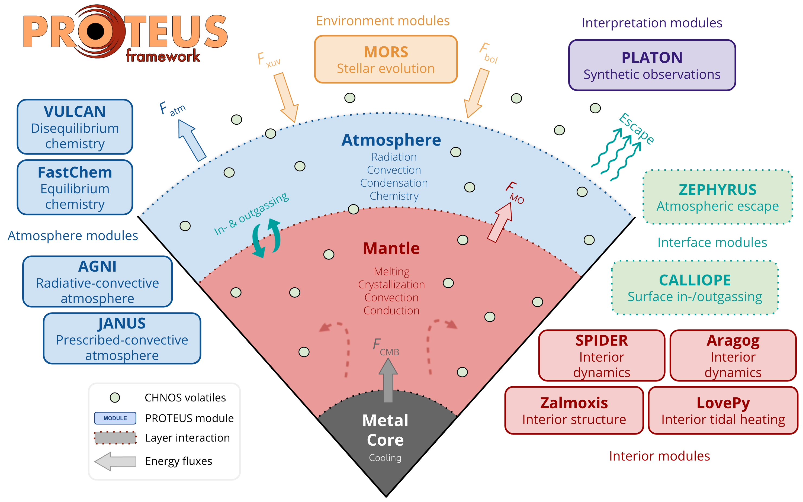

<h1 align="center">
    <a href="https://proteus-framework.org">
    

        
        
    

    </a>
</h1>

# CALLIOPE in the PROTEUS framework

CALLIOPE is the **equilibrium outgassing module** of [PROTEUS](https://proteus-framework.org/PROTEUS) (/ˈproʊtiəs/, PROH-tee-əs), a modular Python framework for the coupled evolution of the atmospheres and interiors of rocky planets and exoplanets.
A schematic of PROTEUS components and corresponding modules is shown below.

       
      <b>Schematic of PROTEUS components and corresponding modules.</b>  

You can find the documentation of each PROTEUS module in the sidebar.

---

## Where CALLIOPE sits in a coupled run

In a PROTEUS coupled run, three submodules deliver the atmosphere-interior physics in a fixed per-iteration order:

| Submodule | Role | State variables |
|---|---|---|
| **Zalmoxis** or **SPIDER** | Static structure: hydrostatic equilibrium, $R_p(M_p)$, $g$, $R_\mathrm{cmb}$, $P_\mathrm{cmb}$ | $\rho(r)$, $g(r)$, $P(r)$ |
| **CALLIOPE** (or atmodeller) | Volatile partitioning: surface partial pressures, dissolved masses, atmospheric mass | $p_i$, $X_i^\mathrm{melt}$, $X_i^\mathrm{atm}$ |
| **Aragog** or **SPIDER** | Thermal evolution: entropy ODE, $T(r)$ trajectory, surface heat flux | $S(r)$, $T(r)$ |

CALLIOPE is the cheapest of the three (a few tens of milliseconds per call), so PROTEUS calls it on every coupling iteration. Its outputs feed the atmosphere radiative transfer module (AGNI or JANUS), which in turn sets the surface temperature boundary condition for the interior thermal evolution.

The atmosphere is closed by AGNI, JANUS, or a dummy radiative-balance module, depending on the configuration; the surface temperature couples back into the entropy ODE through the next CALLIOPE call.

---

## Quick links into the coupling docs

The two pages dedicated to PROTEUS coupling are:

-   :material-rocket-launch: **How to couple CALLIOPE to PROTEUS**

    Practical TOML recipe: minimal `[outgas]` and `[outgas.calliope]` blocks, redox shift, included-volatile flags, solubility on/off, solver tolerances, the dictionary the wrapper builds for `equilibrium_atmosphere()`, and common pitfalls.

    [Go to the how-to](How-to/proteus_coupling.md)

-   :material-book-open-variant: **Theory of the coupling**

    Per-iteration control flow with diagram, the `solvevol_inp` dict the wrapper passes to `calliope.solve.equilibrium_atmosphere()`, the previous-iteration warm-start strategy, the `volatile_mode` switch (`elements` vs `gas_prs`), the elemental-inventory translation (oceans / ppmw / X/H / kg / metallicity), and the `hf_row` keys CALLIOPE writes back.

    [Go to the explainer](Explanations/proteus_coupling.md)

For the PROTEUS-side documentation (config schema, orchestrator behaviour, atmosphere modules, etc.), see [proteus-framework.org/PROTEUS](https://proteus-framework.org/PROTEUS).

---

## Standalone vs PROTEUS-coupled

CALLIOPE is also a self-contained library for one-off equilibrium-chemistry calculations and parameter sweeps. The two modes share the same kernel:

| Mode | Entry point | Configuration |
|---|---|---|
| **Standalone** | `from calliope.solve import equilibrium_atmosphere` | A Python dictionary built by the user (see [Configuration](How-to/configuration.md)). |
| **PROTEUS-coupled** | `proteus start -c <run>.toml` | PROTEUS-side TOML sections `[planet]`, `[planet.elements]` (or `[planet.gas_prs]`), `[outgas]`, `[outgas.calliope]`. The wrapper builds `solvevol_inp` from these and the live `hf_row`. Documented in [Coupling to PROTEUS (how-to)](How-to/proteus_coupling.md). |

The species names (H$_2$O, CO$_2$, N$_2$, S$_2$, ...), the $\Delta\mathrm{IW}$ convention, and the solubility-law identifiers are common to both modes; only the way the solver is invoked differs.

---

## Where the wrapper code lives

CALLIOPE is invoked from PROTEUS via:

- `proteus/outgas/calliope.py`: the wrapper that builds `solvevol_inp` from `config` + `hf_row`, calls `calliope.solve.equilibrium_atmosphere()`, warm-starts from the previous-iteration partial pressures, and writes the results back into `hf_row`.
- `proteus/outgas/wrapper.py`: the dispatch layer that selects between `calliope`, `atmodeller`, and `dummy` outgassing modules; also computes target elemental inventories and runs the binodal H$_2$ partition.
- `proteus/config/_outgas.py`: the attrs-based schema for `[outgas]` and `[outgas.calliope]`. All knobs documented in the how-to map back to fields here.

These files live in the [PROTEUS repository](https://github.com/FormingWorlds/PROTEUS), not in CALLIOPE. Their per-symbol API documentation is rendered in the PROTEUS docs; this site documents the CALLIOPE side of the interface.
